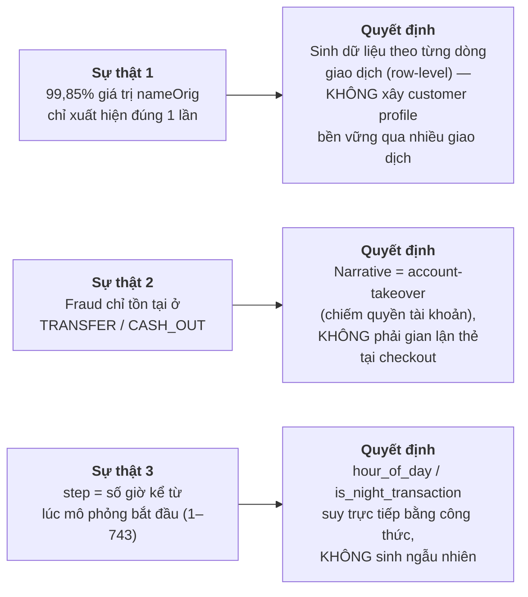
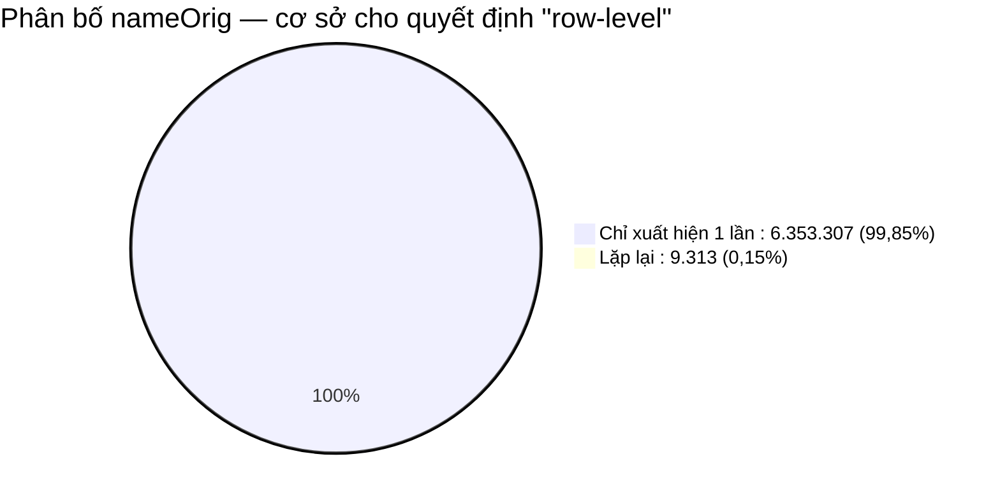
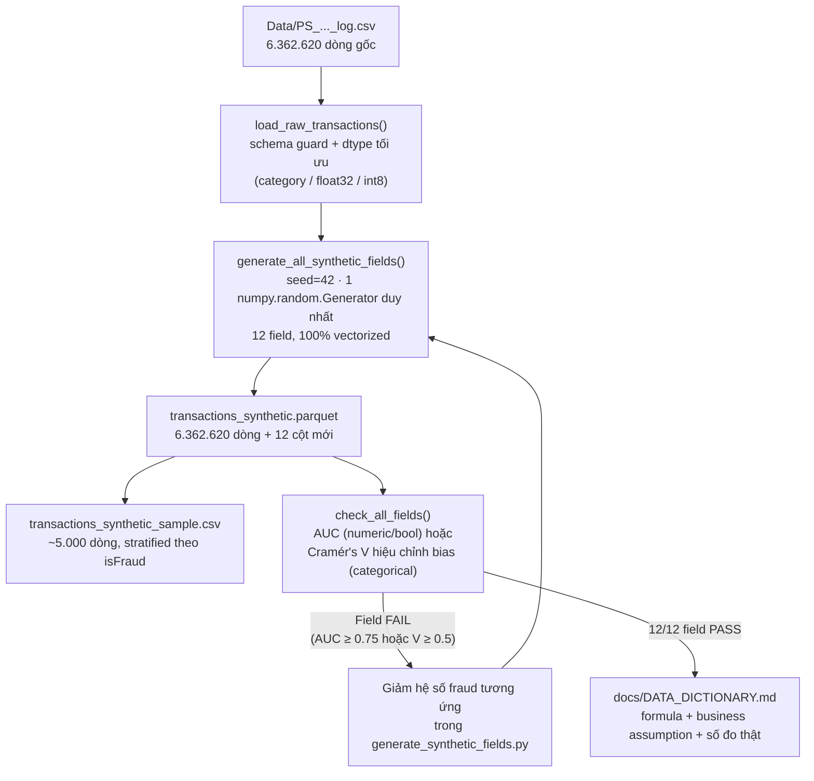
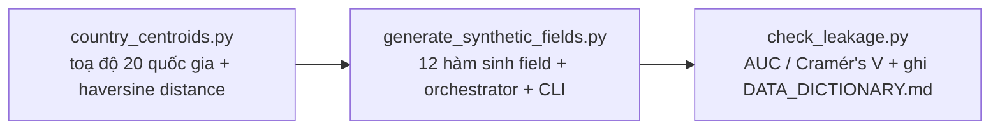
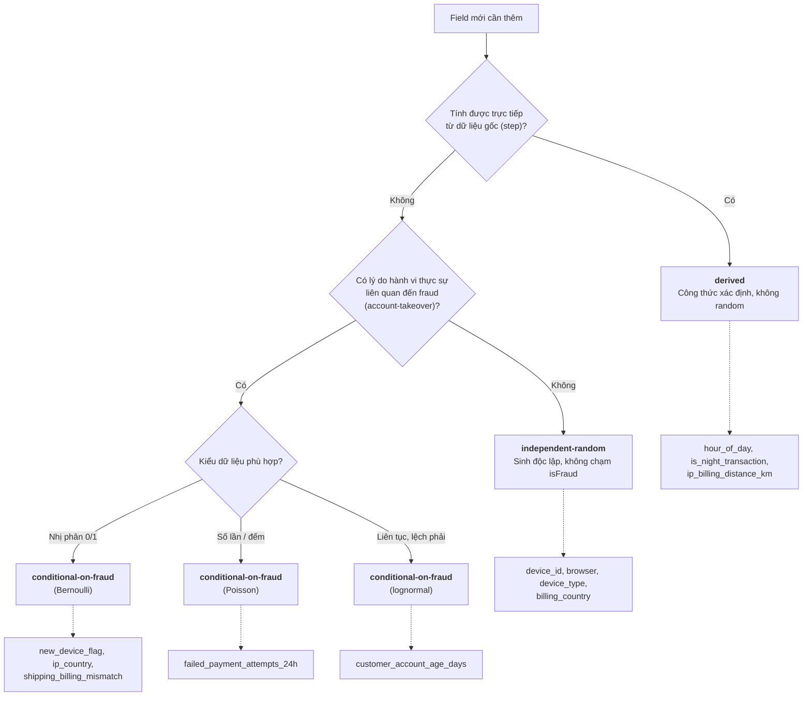
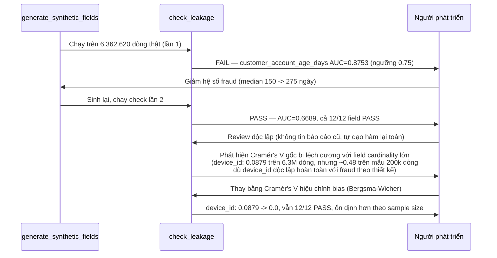

# Synthetic Contextual Data — Chiến lược, Logic & Cách chạy

Module này sinh thêm các trường bối cảnh e-commerce/hành vi (device, IP, thời gian, tài khoản, thanh toán thất bại...) cho dataset PaySim gốc, phục vụ Module 1 (Business Understanding & Data Generation) của đề bài Real-Time Payment Fraud Detection — phần việc của **Người 2 (Data Engineer)**.

Tài liệu này là **nguồn tham khảo đầy đủ, tự chứa** (đọc xong hiểu được toàn bộ logic/chiến lược/quy tắc, không cần mở file khác). Tài liệu gốc chi tiết hơn nếu cần tra cứu sâu:
- Spec (thiết kế + lý do từng quyết định): [`docs/superpowers/specs/2026-07-03-synthetic-data-nguoi2-design.md`](docs/superpowers/specs/2026-07-03-synthetic-data-nguoi2-design.md)
- Plan (12 task TDD, code chi tiết): [`docs/superpowers/plans/2026-07-03-synthetic-data-nguoi2-plan.md`](docs/superpowers/plans/2026-07-03-synthetic-data-nguoi2-plan.md)
- Data dictionary (sinh tự động từ code, số liệu đo thực tế): [`docs/DATA_DICTIONARY.md`](docs/DATA_DICTIONARY.md)

---

## 1. Tổng quan

**Bài toán:** Kaggle PaySim chỉ có dữ liệu giao dịch tài chính thô (số tiền, số dư, loại giao dịch...), không có các trường "bối cảnh e-commerce" mà đề bài yêu cầu (device fingerprint, khoảng cách IP-billing, tuổi tài khoản, mismatch địa chỉ, số lần thanh toán thất bại, pattern theo giờ). Module này sinh thêm 12 trường đó bằng Python (Faker + business logic tự viết), đồng thời **tự kiểm tra khách quan** để đảm bảo dữ liệu sinh ra thực tế nhưng không "lộ" nhãn fraud một cách giả tạo (data leakage).

**Nguồn dữ liệu:** `Data/PS_20174392719_1491204439457_log.csv` — PaySim / Online Payments Fraud Dataset, **6.362.620 dòng, dùng toàn bộ** (không lấy mẫu). Cột gốc: `step, type, amount, nameOrig, oldbalanceOrg, newbalanceOrig, nameDest, oldbalanceDest, newbalanceDest, isFraud, isFlaggedFraud`.

---

## 2. Sự thật dữ liệu → Quyết định thiết kế

Trước khi viết bất kỳ dòng code nào, 3 sự thật sau được **đo trực tiếp trên file gốc** và quyết định toàn bộ hướng thiết kế:



Chi tiết sự thật 1 (đo trên toàn bộ 6.362.620 dòng):



Chi tiết sự thật 2 — số fraud theo loại giao dịch (khớp đúng tỷ lệ 0,1291% đã có trong audit trước đó):

| Loại giao dịch | Số dòng | Số fraud |
|---|---|---|
| `TRANSFER` | 532.909 | 4.097 |
| `CASH_OUT` | 2.237.500 | 4.116 |
| `PAYMENT` | 2.151.495 | 0 |
| `CASH_IN` | 1.399.284 | 0 |
| `DEBIT` | 41.432 | 0 |

**Vì sao quan trọng:** nếu bỏ qua bước đo này và thiết kế theo trực giác thông thường (customer profile bền vững, narrative "checkout fraud"), thiết kế sẽ sai lệch với chính dữ liệu đang dùng.

---

## 3. Nguyên tắc thiết kế cốt lõi

| # | Nguyên tắc | Lý do |
|---|---|---|
| 1 | Sinh **row-level**, không customer profile | Sự thật 1 — không có lịch sử khách hàng đáng kể để dùng lại |
| 2 | Chỉ tiêm tín hiệu fraud vào field **có lý do hành vi thật** (new device, IP lệch, giờ đêm, tài khoản mới, mismatch địa chỉ, thất bại thanh toán). Field không có cơ sở hành vi (`browser`, `device_type`, `device_id`, `billing_country`) sinh **độc lập** với `isFraud` | Dữ liệu gian lận thật không bao giờ có *mọi* field tương quan với nhãn — nếu ép hết thì chính là dấu hiệu leakage giả tạo |
| 3 | Mọi hệ số (odds-ratio, Poisson λ, median gap) **giới hạn 2–4 lần baseline** | Đề bài yêu cầu "justify the realism" — số phải giải trình được, không phải chọn để đạt AUC cao. Fraud giỏi vẫn giả mạo được hành vi bình thường, nên tín hiệu không bao giờ tuyệt đối |
| 4 | Field tính được trực tiếp từ dữ liệu gốc (`step`) thì **suy bằng công thức**, không random | Không có lý do "đoán" khi dữ liệu gốc đã cho biết chính xác |
| 5 | Đo leakage **khách quan bằng số** sau khi sinh, không chỉ "cảm thấy hợp lý" | AUC/Cramér's V là con số lặp lại được, là bằng chứng "rigor" khi chấm điểm |

---

## 4. Kiến trúc pipeline



**Module phụ trách từng phần:**



**Nguyên tắc kỹ thuật:** mọi hàm sinh dữ liệu dùng **numpy/pandas vectorized** (không loop qua từng dòng trong 6,3 triệu dòng), dùng chung **một** `numpy.random.Generator(seed=42)` cho cả lượt chạy → kết quả **tái lập được 100%** khi chạy lại với cùng input.

---

## 5. Quy tắc phân loại field (logic quyết định mỗi field sinh thế nào)



---

## 6. Chi tiết 12 field synthetic

| # | Field | Loại sinh | Base → Fraud | Lập luận chọn số |
|---|---|---|---|---|
| 1 | `hour_of_day` | derived | `(step - 1) % 24` | Suy trực tiếp từ `step`, không cần giả định |
| 2 | `is_night_transaction` | derived | `hour_of_day ∈ [0,5]` | Định nghĩa "đêm" = 0h–6h, quy ước phổ biến trong nghiên cứu fraud theo giờ |
| 3 | `customer_account_age_days` | conditional (lognormal) | median 400 → 275 ngày¹ | Tài khoản bị chiếm đoạt/mule thường tạo gần đây hơn — hệ số thận trọng, là business assumption, không suy từ số liệu thực |
| 4 | `device_id` | độc lập | pool cố định 50.000 UUID (Faker) | Không tự thân là tín hiệu fraud; tín hiệu nằm ở `new_device_flag` (#7), tránh trùng lặp thông tin |
| 5 | `browser` | độc lập | Chrome 55% / Safari 20% / Edge 12% / Firefox 8% / Other 5% | Không có cơ sở hành vi để gắn với fraud — cố ý trung lập, tránh over-signal giả tạo |
| 6 | `device_type` | độc lập | mobile 65% / desktop 30% / tablet 5% | Tương tự #5 |
| 7 | `new_device_flag` | conditional (Bernoulli) | p = 0.04 → 0.12 (3x) | ~4% giao dịch hợp pháp từ thiết bị mới là hợp lý; fraud tăng gấp 3 vì account-takeover thường từ thiết bị lạ, nhưng không tuyệt đối |
| 8 | `billing_country` | độc lập | categorical, 20 quốc gia | Mô phỏng cơ cấu khách hàng nền tảng; tín hiệu nằm ở mismatch (#9), không phải ở đây |
| 9 | `ip_country` | conditional | match rate 0.93 → 0.80 | Giao dịch hợp pháp đa số dùng IP đúng quốc gia; fraud lệch cao hơn nhưng vẫn phần lớn trùng (VPN/proxy giúp fraud giả mạo IP) |
| 10 | `ip_billing_distance_km` | **derived** từ #8, #9 | `haversine(centroid[ip_country], centroid[billing_country])` | Tính trực tiếp bằng bảng tọa độ cố định — đảm bảo nhất quán nội tại, không mâu thuẫn với mismatch flag |
| 11 | `shipping_billing_mismatch` | conditional (Bernoulli) | p = 0.05 → 0.15 (3x) | Một số khách hợp pháp có địa chỉ giao khác đăng ký (quà tặng, công ty); fraud tăng vì có thể đổi hướng nhận tiền/hàng. Diễn giải lại thành "địa chỉ giao dịch khác đăng ký" do fraud PaySim là account-takeover, không phải checkout thẻ |
| 12 | `failed_payment_attempts_24h` | conditional (Poisson) | λ = 0.15 → 0.6 (4x) | Đa số giao dịch hợp pháp không có lần thất bại trước; kẻ gian thường thử nhiều lần trước khi thành công |

¹ Giá trị 275 (thay vì 150 như thiết kế ban đầu) đã được **tinh chỉnh sau khi kiểm tra leakage trên dữ liệu thật** — xem mục 7.

---

## 7. Cơ chế chống leakage — và 2 lần đã phát hiện + sửa lỗi thật

**Quy trình:** sau khi sinh xong, tính **AUC đơn biến** (field numeric/boolean) hoặc **Cramér's V** (field categorical) so với `isFraud`. Ngưỡng FAIL: `AUC ≥ 0.75` hoặc `Cramér's V ≥ 0.5`. Nếu FAIL → giảm hệ số ở mục 6, sinh lại — **không đổi ngưỡng để "cho qua"**.

Đây không chỉ là lý thuyết — quy trình này đã thực sự bắt được 2 lỗi trong quá trình build:



**Bài học rút ra (áp dụng khi bạn chạy trên dữ liệu của mình):**
- Nếu `check_leakage` báo FAIL, đó là quy trình đang hoạt động đúng — không phải bug. Xem mục 9 để biết cách xử lý.
- Cramér's V dùng công thức **hiệu chỉnh bias** (không phải công thức chuẩn sách giáo khoa) vì field cardinality lớn (`device_id`, 50.000 giá trị) bị lệch dương với công thức gốc, đặc biệt nhạy với **kích thước dataset** — nếu bạn chạy trên dataset nhỏ hơn/khác kích thước, công thức hiệu chỉnh này giúp kết quả đáng tin cậy hơn.

---

## 8. Kết quả đo được trên dữ liệu thật (6.362.620 dòng)

Row count và tỷ lệ fraud giữ nguyên (0,1291%) so với file gốc — bước sinh dữ liệu **không làm thay đổi class imbalance** (xử lý imbalance kỹ thuật là việc của Module 4, ngoài phạm vi module này).

| Field | Metric | Giá trị đo được | Kết quả |
|---|---|---|---|
| `hour_of_day` | AUC | 0.6336 | PASS |
| `is_night_transaction` | AUC | 0.6217 | PASS |
| `customer_account_age_days` | AUC | 0.6689 | PASS |
| `device_id` | Cramér's V (hiệu chỉnh bias) | 0.0 | PASS |
| `browser` | Cramér's V (hiệu chỉnh bias) | 0.0 | PASS |
| `device_type` | Cramér's V (hiệu chỉnh bias) | 0.0004 | PASS |
| `new_device_flag` | AUC | 0.5419 | PASS |
| `billing_country` | Cramér's V (hiệu chỉnh bias) | 0.0 | PASS |
| `ip_country` | Cramér's V (hiệu chỉnh bias) | 0.0049 | PASS |
| `ip_billing_distance_km` | AUC | 0.5651 | PASS |
| `shipping_billing_mismatch` | AUC | 0.5495 | PASS |
| `failed_payment_attempts_24h` | AUC | 0.6589 | PASS |

Số liệu đầy đủ kèm data type, unit, formula, business assumption: [`docs/DATA_DICTIONARY.md`](docs/DATA_DICTIONARY.md) (file này được **sinh tự động từ code**, không phải điền tay).

---

## 9. Cấu trúc code & test

```
src/data_generation/
  country_centroids.py          # Bảng tọa độ 20 quốc gia + haversine distance
  generate_synthetic_fields.py  # 12 hàm sinh field + orchestrator + CLI (CSV -> Parquet)
  check_leakage.py              # AUC / Cramér's V (bias-corrected) + sinh docs/DATA_DICTIONARY.md
tests/data_generation/          # 52 unit test (pytest) — mọi field, mọi công thức, mọi bất biến
```

52 test bao gồm: đúng tỷ lệ base/fraud theo từng công thức, tái lập được (reproducibility), không tràn kiểu dữ liệu (dtype overflow), bất biến toán học được kiểm tra exhaustive (ví dụ: `ip_country` không bao giờ trùng ngẫu nhiên với `billing_country` khi mismatch), và schema guard khi đọc CSV.

## 10. Cách chạy

Yêu cầu: Python 3.13 (ví dụ `C:\ProgramData\miniconda3\python.exe`), chạy trong git-bash/MSYS.

```bash
# 1. Tạo venv và cài dependency (chỉ cần 1 lần)
"/c/ProgramData/miniconda3/python.exe" -m venv .venv
.venv/Scripts/python.exe -m pip install -r requirements.txt

# 2. Chạy test
.venv/Scripts/python.exe -m pytest tests/ -v

# 3. Sinh synthetic data từ dataset gốc (Data/PS_20174392719_1491204439457_log.csv)
PYTHONPATH=src .venv/Scripts/python.exe -m data_generation.generate_synthetic_fields
# -> data/processed/transactions_synthetic.parquet
# -> data/processed/transactions_synthetic_sample.csv (mẫu ~5.000 dòng, stratified theo isFraud)

# 4. Kiểm tra leakage + sinh data dictionary
PYTHONPATH=src .venv/Scripts/python.exe -m data_generation.check_leakage
# -> docs/DATA_DICTIONARY.md
```

**Nếu file CSV của bạn khác cấu trúc** (thiếu cột): bước 3 sẽ báo `ValueError` nêu rõ tên cột thiếu, thay vì lỗi pandas khó hiểu.

**Nếu bước 4 báo FAIL cho field nào:** mở `generate_synthetic_fields.py`, tìm hằng số điều khiển hệ số fraud của field đó (ví dụ `NEW_DEVICE_FLAG_FRAUD_P`, `FAILED_ATTEMPTS_FRAUD_LAMBDA`...), giảm nó về gần baseline hơn (theo đúng nguyên tắc #3 ở mục 3 — giảm, không xoá tín hiệu), chạy lại bước 3 rồi bước 4 đến khi tất cả PASS. Đây là quy trình đã được dùng thật (mục 7), không phải lý thuyết suông.

---

## 11. Giới hạn & rủi ro đã biết

- Các hệ số odds-ratio/λ là giả định nghiệp vụ tự đặt, không suy từ số liệu fraud thực tế công khai nào (PaySim không đi kèm dữ liệu loại này).
- `shipping_billing_mismatch` được diễn giải lại thành "địa chỉ giao dịch khác địa chỉ đăng ký" do fraud trong PaySim là account-takeover, không phải gian lận thẻ tại checkout.
- 9.313 `nameOrig` có lặp lại (0,15%) được xử lý như dòng độc lập, không có logic đặc biệt.
- Cột `amount`/số dư gốc lưu ở `float32` (tối ưu bộ nhớ cho 6,3 triệu dòng) — có thể mất độ chính xác nhỏ ở các giá trị số dư lớn; không ảnh hưởng 12 field synthetic (chúng không dùng các cột này).

## 12. Bàn giao cho các vai trò khác

- **Feature Engineer:** field string (`device_id`, `billing_country`, `ip_country`, `browser`, `device_type`) cần encode; `ip_billing_distance_km`, `failed_payment_attempts_24h` đã là numeric, dùng trực tiếp được.
- **ML Engineer:** feature balance hiện có (`sender_balance_delta`...) cho AUC-PR rất cao (~0.9988) — khả năng leak sẵn có trong PaySim (fraud thường rút sạch số dư). Nên train có/không các feature đó để so sánh, tránh đánh giá sai giá trị của field synthetic mới.
