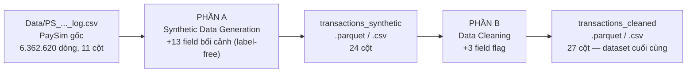
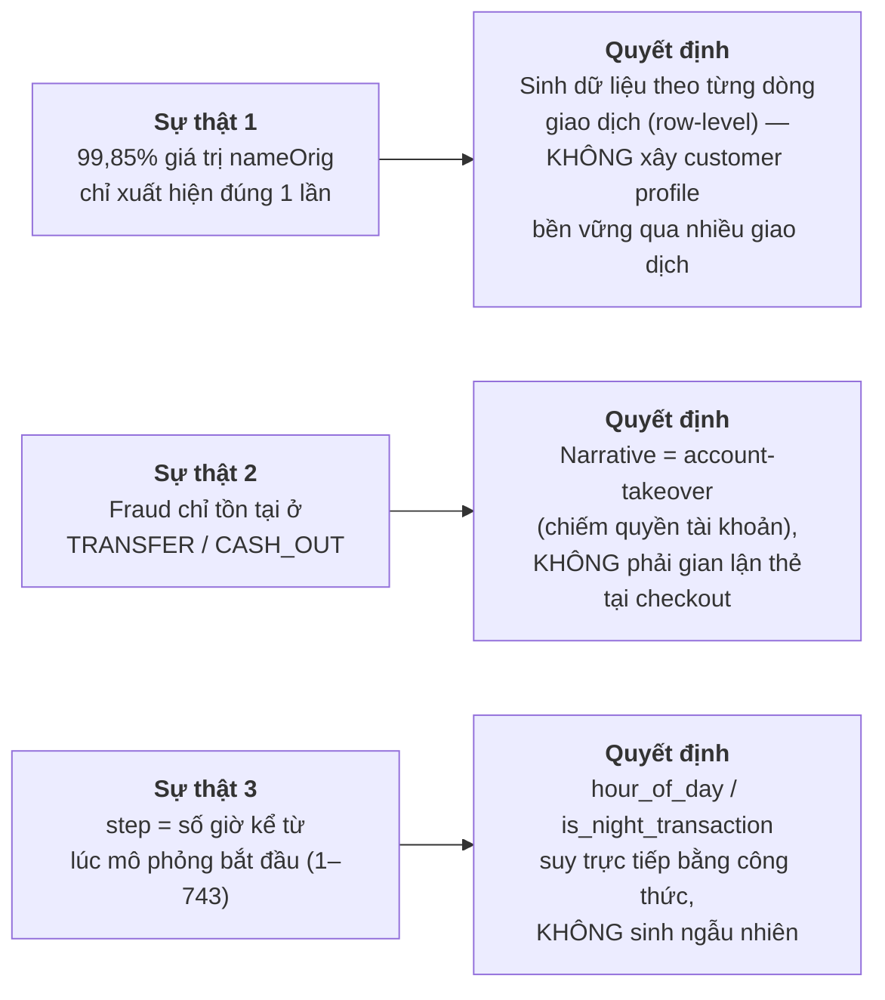
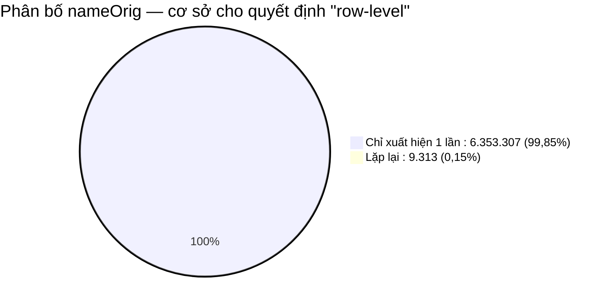
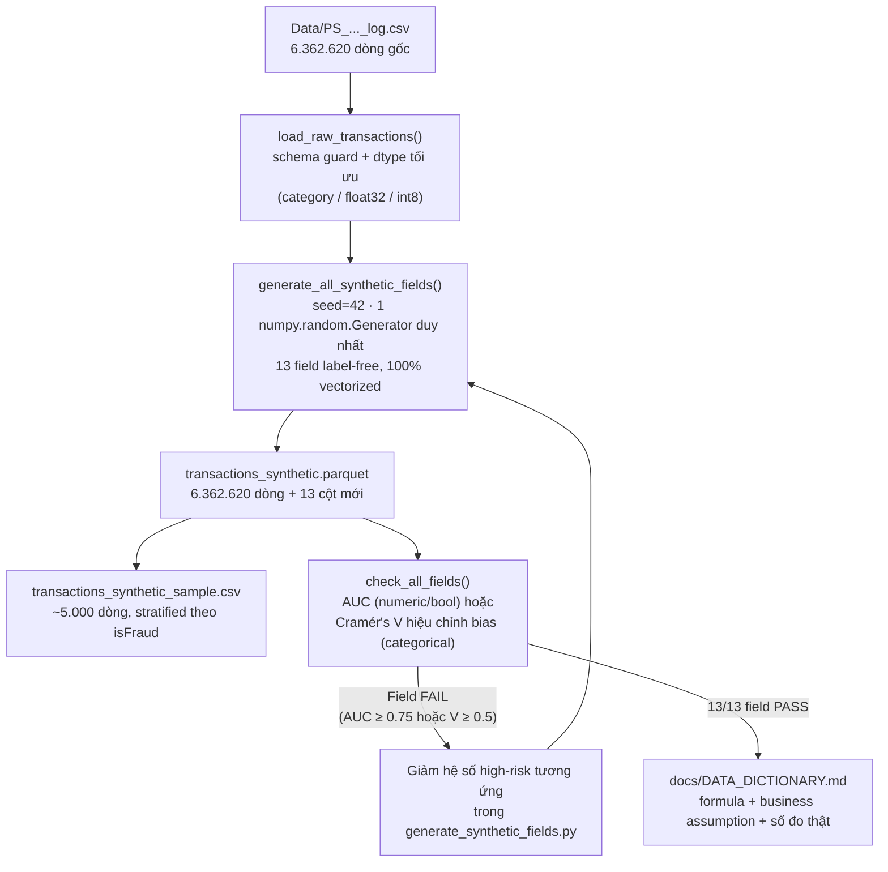
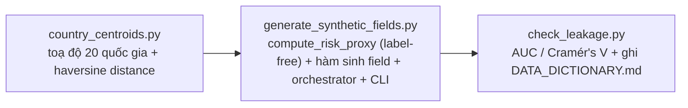
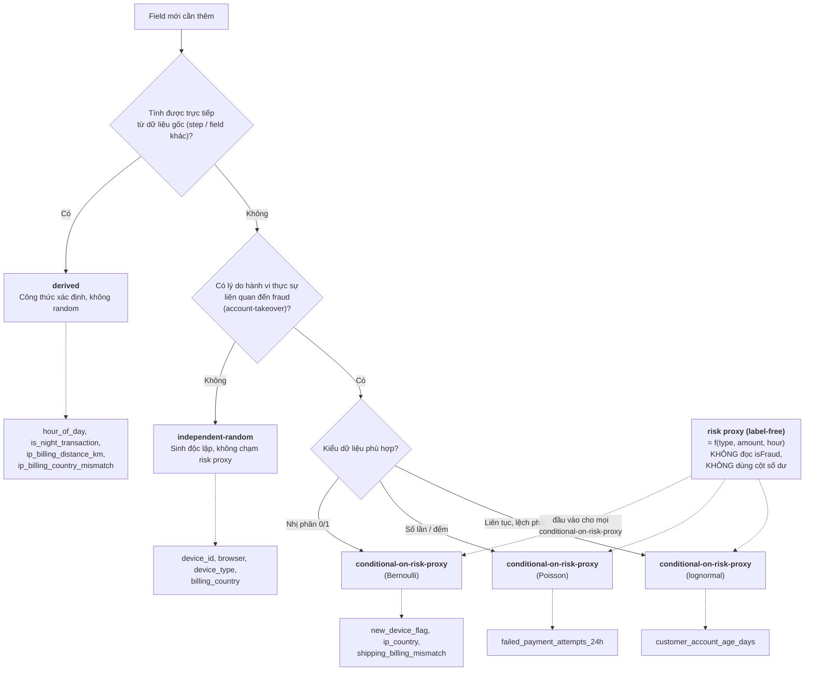
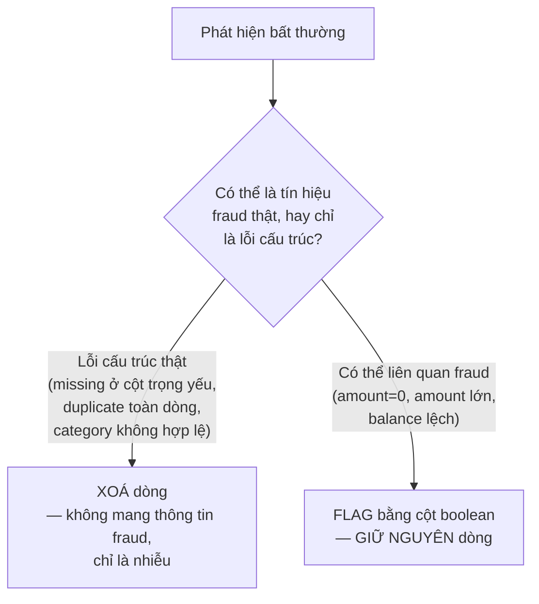

# Data Pipeline: Synthetic Generation & Cleaning — Chiến lược, Logic & Cách chạy

Pipeline 2 giai đoạn cho dataset PaySim, phục vụ bài toán phát hiện gian lận thanh toán (fraud detection) theo thời gian thực: **(A) sinh thêm 13 trường bối cảnh e-commerce/hành vi (label-free)**, rồi **(B) kiểm tra và làm sạch dữ liệu** (missing values, duplicates, invalid categories, outliers) trước khi bàn giao cho bước feature engineering/modeling.

Tài liệu này là **nguồn tham khảo đầy đủ, tự chứa** — đọc xong hiểu toàn bộ logic/chiến lược/quy tắc của cả 2 giai đoạn, không cần mở file khác. Tài liệu gốc chi tiết hơn nếu cần tra cứu sâu:
- Spec sinh dữ liệu: [`docs/superpowers/specs/2026-07-03-synthetic-data-nguoi2-design.md`](docs/superpowers/specs/2026-07-03-synthetic-data-nguoi2-design.md) · Plan: [`...-nguoi2-plan.md`](docs/superpowers/plans/2026-07-03-synthetic-data-nguoi2-plan.md)
- Spec cleaning: [`docs/superpowers/specs/2026-07-03-data-cleaning-design.md`](docs/superpowers/specs/2026-07-03-data-cleaning-design.md) · Plan: [`...-data-cleaning-plan.md`](docs/superpowers/plans/2026-07-03-data-cleaning-plan.md)
- Data dictionary (tự sinh): [`docs/DATA_DICTIONARY.md`](docs/DATA_DICTIONARY.md) · Cleaning report (tự sinh): [`docs/CLEANING_REPORT.md`](docs/CLEANING_REPORT.md)
- Tổng kết quá trình làm việc (quyết định, vấn đề đã phát hiện & xử lý): [`docs/PROJECT_SUMMARY.md`](docs/PROJECT_SUMMARY.md)

## 0. Bối cảnh nghiệp vụ: PaySim là gì, và bài toán fraud detection

**PaySim** là bộ mô phỏng giao dịch tiền di động (mobile money) dựa trên agent-based simulation, do Lopez-Rojas, Elmir và Axelsson công bố năm 2016. Nó được xây từ log giao dịch thật (đã ẩn danh) của 1 dịch vụ mobile money ở châu Phi trong 1 tháng, rồi **mô phỏng lại** ở quy mô lớn hơn sao cho giữ đúng các đặc tính thống kê của dữ liệu gốc (tỷ lệ fraud, phân phối amount, hành vi theo loại giao dịch...) nhưng có thể công khai chia sẻ mà không lộ thông tin khách hàng thật. Nói cách khác: **các con số trong PaySim không phải giao dịch thật của 1 người cụ thể, nhưng được calibrate để có phân phối thống kê giống thật.**

**5 loại giao dịch mô phỏng:** `CASH_IN` (nạp tiền vào tài khoản), `CASH_OUT` (rút tiền), `DEBIT` (trừ tiền/thanh toán qua thẻ), `PAYMENT` (thanh toán hàng hóa/dịch vụ), `TRANSFER` (chuyển tiền giữa 2 tài khoản).

**Fraud trong PaySim mô phỏng đúng 1 kịch bản: account-takeover.** Một agent "kẻ gian" chiếm được quyền truy cập 1 tài khoản khách hàng, rồi cố **chuyển tiền đi (`TRANSFER`) hoặc rút hết tiền (`CASH_OUT`)** trước khi bị phát hiện. Đây là lý do fraud chỉ xuất hiện ở 2 loại giao dịch này (đo được ở mục 3) — **không mô phỏng** gian lận thẻ tại checkout hay gian lận giả mạo danh tính lúc mở tài khoản.

**Bài toán kinh doanh cần giải (theo đề bài `yeucau.txt`):** với mỗi giao dịch đến, hệ thống phải quyết định gần như ngay lập tức: cho qua (approve), yêu cầu review thủ công, hay chặn (block) — cân bằng giữa **chặn được fraud** (tránh mất tiền) và **không làm phiền khách hàng thật** (friction). Muốn quyết định được, model cần *tín hiệu hành vi* (device, vị trí, thời gian, lịch sử thanh toán...) mà PaySim gốc **không có** — đây chính là lý do tồn tại của Phần A (Synthetic Data Generation) trong tài liệu này. Pipeline ở đây (2 giai đoạn: sinh dữ liệu + làm sạch) là **bước nền tảng đầu tiên** trong toàn bộ 8 module của đề bài; các module sau (EDA, feature engineering, model, deploy, monitor) đều xây trên output `transactions_cleaned.parquet` của pipeline này.

## 1. Tổng quan toàn bộ pipeline



**Nguồn dữ liệu:** `Data/PS_20174392719_1491204439457_log.csv` — PaySim / Online Payments Fraud Dataset, **6.362.620 dòng, dùng toàn bộ** (không lấy mẫu). Cột gốc: `step, type, amount, nameOrig, oldbalanceOrg, newbalanceOrig, nameDest, oldbalanceDest, newbalanceDest, isFraud, isFlaggedFraud`.

### ✅ Trạng thái xác thực (verify lại được, không phải khẳng định suông)

| Kiểm tra | Kết quả | Lệnh để tự verify lại |
|---|---|---|
| Test suite | **116/116 PASS** | `.venv/Scripts/python.exe -m pytest tests/ -v` |
| Leakage check trên 6.362.620 dòng thật | **13/13 PASS** | `PYTHONPATH=src .venv/Scripts/python.exe -m data_generation.check_leakage` |
| Không hàm sinh nào đọc `isFraud` | **Xác nhận bằng grep, 0 kết quả sai** | `grep -n "isFraud\|is_fraud" src/data_generation/generate_synthetic_fields.py` |
| `transactions_synthetic.parquet` | 6.362.620 dòng × **24 cột** | đọc bằng `pandas.read_parquet` |
| `transactions_cleaned.parquet` | 6.362.620 dòng × **27 cột** — **data final** | đọc bằng `pandas.read_parquet` |
| Fraud rate giữ nguyên qua cả 2 giai đoạn | 8.213 / 6.362.620 = **0,1291%** | so với file gốc |
| Code khớp với commit nào | `82d54af` (2026-07-23) | `git log -1` |

Mọi số liệu trong tài liệu này (AUC, số dòng, số cột) đều lấy trực tiếp từ lần chạy thật tương ứng với commit trên — không phải số ước lượng hay copy từ thiết kế ban đầu.

## Khái niệm nền tảng: Synthetic Data và Data Cleaning khác nhau ở đâu

Hai giai đoạn này thường bị nhầm là "cùng loại việc xử lý dữ liệu" — thực ra chúng đối lập nhau về **hướng tác động lên dữ liệu**:

| | **Phần A — Synthetic Data Generation** | **Phần B — Data Cleaning** |
|---|---|---|
| **Hướng tác động** | **THÊM** thông tin mới — tạo ra field chưa từng tồn tại | **KIỂM TRA + XỬ LÝ** thông tin đã có — không tạo field nội dung mới |
| **Input** | 11 cột PaySim gốc | 24 cột = 11 gốc + 13 synthetic (output của Phần A) |
| **Output** | +13 cột mới (24 cột) | +3 cột **flag** boolean (27 cột) — không phải field nội dung, chỉ là "nhãn cảnh báo" |
| **Hành động cốt lõi** | **SINH** (generate) giá trị bằng công thức/phân phối xác suất, có `numpy.random.Generator(seed=42)` | **PHÂN LOẠI** mỗi bất thường: lỗi cấu trúc thật → xoá dòng; có thể là tín hiệu fraud → flag, giữ dòng |
| **Câu hỏi phải trả lời** | "Field này nên mang giá trị gì, dựa trên business logic nào?" | "Dòng/giá trị bất thường này là lỗi nhập liệu, hay là chính tín hiệu cần học?" |
| **Rủi ro lớn nhất cần né** | **Data leakage** — field vô tình trở thành bản sao/proxy gần như hoàn hảo của `isFraud` | **Mất tín hiệu fraud thật** — xoá nhầm outlier/dòng hiếm vì tưởng là "rác" |
| **Cơ chế bảo vệ** | Label-free generation (`compute_risk_proxy`, không đọc `isFraud`) + đo leakage bằng AUC/Cramér's V sau khi sinh | "Flag, không xoá" — chỉ xoá khi xác nhận là lỗi cấu trúc thật (đo được = 0 dòng trên data này) |
| **Nếu làm sai sẽ dẫn tới** | Model "ăn gian" nhờ field lộ nhãn trực tiếp/gián tiếp → vô dụng khi gặp dữ liệu thật ngoài PaySim | Model không học được pattern fraud hiếm vì dữ liệu hiếm đó đã bị xoá nhầm lúc "làm sạch" |
| **Vì sao Phần A chạy TRƯỚC Phần B** | — | Phần B phải kiểm tra **toàn bộ 24 cột** (gồm cả 13 cột mới của Phần A) chứ không chỉ 11 cột gốc — nên bắt buộc có input đầy đủ từ Phần A trước |

**Tóm 1 câu:** Synthetic Data trả lời "cần thêm gì vào dữ liệu", Data Cleaning trả lời "dữ liệu đang có (cả cũ và mới) có đáng tin không, và bất thường nào nên giữ lại làm tín hiệu". Cả hai đều dùng chung 1 nguyên tắc xuyên suốt: **không tạo ra hoặc xoá đi tín hiệu fraud một cách giả tạo**.

---

# PHẦN A — SYNTHETIC DATA GENERATION

## 2. Bài toán

Kaggle PaySim chỉ có dữ liệu giao dịch tài chính thô (số tiền, số dư, loại giao dịch...), không có các trường "bối cảnh e-commerce" cần thiết để mô hình fraud detection có đủ tín hiệu hành vi (device fingerprint, khoảng cách IP-billing, tuổi tài khoản, mismatch địa chỉ, số lần thanh toán thất bại, pattern theo giờ). Phần A sinh thêm 13 trường đó bằng Python (Faker + business logic tự viết), đồng thời **tự kiểm tra khách quan** để đảm bảo dữ liệu sinh ra thực tế nhưng không "lộ" nhãn fraud một cách giả tạo (data leakage).

> **Nguyên lý sinh dữ liệu — LABEL-FREE (quan trọng, đọc trước):** không hàm sinh field nào đọc `isFraud`. Các field "có lý do hành vi" được điều kiện theo một **risk proxy label-free** (`compute_risk_proxy`) chỉ tính từ biến quan sát được (`type`, `amount`, `hour_of_day`) — cố ý **không** dùng `oldbalanceOrg`/`newbalanceOrig` vì 2 cột số dư này gần như xác định `isFraud` trong PaySim (fraud = rút cạn tài khoản), dùng chúng sẽ leak qua cửa sau. `isFraud` chỉ được dùng **sau khi sinh xong** để đo leakage / train / evaluate. **Lưu ý trung thực:** vì risk proxy là hàm của `type/amount/hour`, các field điều kiện theo nó về bản chất là hàm nhiễu của các cột đó — tương quan với fraud là **do thiết kế, không phải bằng chứng dự đoán trên fraud thật** (xem mục 19).

## 3. Sự thật dữ liệu → Quyết định thiết kế

Trước khi viết bất kỳ dòng code nào, 3 sự thật sau được **đo trực tiếp trên file gốc** và quyết định toàn bộ hướng thiết kế:



Chi tiết sự thật 1 (đo trên toàn bộ 6.362.620 dòng):



Chi tiết sự thật 2 — số fraud theo loại giao dịch (khớp đúng tỷ lệ 0,1291% đã có trong audit trước đó):

| Loại giao dịch | Số dòng | Số fraud |
|---|---|---|
| `TRANSFER` | 532.909 | 4.097 |
| `CASH_OUT` | 2.237.500 | 4.116 |
| `PAYMENT` | 2.151.495 | 0 |
| `CASH_IN` | 1.399.284 | 0 |
| `DEBIT` | 41.432 | 0 |

**Vì sao quan trọng:** nếu bỏ qua bước đo này và thiết kế theo trực giác thông thường (customer profile bền vững, narrative "checkout fraud"), thiết kế sẽ sai lệch với chính dữ liệu đang dùng.

## 4. Nguyên tắc thiết kế cốt lõi

| # | Nguyên tắc | Lý do |
|---|---|---|
| 1 | Sinh **row-level**, không customer profile | Sự thật 1 — không có lịch sử khách hàng đáng kể để dùng lại |
| 2 | **LABEL-FREE:** không hàm sinh nào đọc `isFraud`. Field "có lý do hành vi" (new device, IP lệch, tài khoản mới, mismatch địa chỉ, thất bại thanh toán) điều kiện theo **risk proxy** tính từ observable (`type`/`amount`/`hour`); field không có cơ sở hành vi (`browser`, `device_type`, `device_id`, `billing_country`) sinh **độc lập** | `isFraud` là biến cần dự đoán — dùng nó lúc sinh feature là dấu hiệu leakage kinh điển mà giám khảo soi ngay; risk proxy label-free tránh điều đó và về nguyên tắc tính lại được lúc scoring |
| 3 | Risk proxy **cố ý tránh** `oldbalanceOrg`/`newbalanceOrig` | 2 cột số dư này gần như xác định `isFraud` trong PaySim; nếu proxy dùng chúng, field sinh ra sẽ leak qua cửa sau (mạnh hơn cả cách cũ) |
| 4 | Mọi hệ số (odds-ratio, Poisson λ, median gap) **giới hạn 2–4 lần baseline** | Mỗi con số phải giải trình được (justify the realism), không phải chọn để đạt AUC cao. Fraud giỏi vẫn giả mạo được hành vi bình thường, nên tín hiệu không bao giờ tuyệt đối |
| 5 | Field tính được trực tiếp từ dữ liệu gốc (`step`) thì **suy bằng công thức**, không random | Không có lý do "đoán" khi dữ liệu gốc đã cho biết chính xác |
| 6 | Đo leakage **khách quan bằng số** sau khi sinh, không chỉ "cảm thấy hợp lý" | AUC/Cramér's V là con số lặp lại được, là bằng chứng khách quan cho tính rigor của quy trình. **Vẫn bắt buộc chạy dù đã label-free** — label-free KHÔNG tự động hết leak trên PaySim |

## 5. Kiến trúc pipeline sinh dữ liệu



**Module phụ trách từng phần:**



**Nguyên tắc kỹ thuật:** mọi hàm sinh dữ liệu dùng **numpy/pandas vectorized** (không loop qua từng dòng trong 6,3 triệu dòng), dùng chung **một** `numpy.random.Generator(seed=42)` cho cả lượt chạy → kết quả **tái lập được 100%** khi chạy lại với cùng input.

## 6. Quy tắc phân loại field (logic quyết định mỗi field sinh thế nào)



## 7. Chi tiết 13 field synthetic

`risk_score = compute_risk_proxy(type, amount, hour_of_day)` — label-free, giá trị trong [0, 1], **không đọc `isFraud`, không dùng `oldbalanceOrg`/`newbalanceOrig`**. 5 field "conditional" dưới đây nội suy tuyến tính giữa base (risk_score=0) và high-risk (risk_score=1), giữ đúng biên độ 2–4x như thiết kế gốc — chỉ đổi biến điều kiện từ `isFraud` sang `risk_score`.

| # | Field | Loại sinh | Base → High-risk | Lập luận chọn số |
|---|---|---|---|---|
| 1 | `hour_of_day` | derived | `(step - 1) % 24` | Suy trực tiếp từ `step`, không cần giả định |
| 2 | `is_night_transaction` | derived | `hour_of_day ∈ [0,5]` | Định nghĩa "đêm" = 0h–6h, quy ước phổ biến trong nghiên cứu fraud theo giờ |
| 3 | `customer_account_age_days` | conditional-on-risk-proxy (lognormal) | median 400 → 275 ngày | Tài khoản bị chiếm đoạt/mule thường tạo gần đây hơn — hệ số thận trọng, là business assumption, không suy từ số liệu thực |
| 4 | `device_id` | joint với #7 (xem mục 7b) | pool cố định 50.000 UUID (Faker) | Với 99,85% account xuất hiện đúng 1 lần: độc lập, như trước. Với account lặp lại (~9.298 account, xem mục 7b): sinh cùng lúc với #7 để nhất quán lịch sử thiết bị của account đó |
| 5 | `browser` | độc lập | Chrome 55% / Safari 20% / Edge 12% / Firefox 8% / Other 5% | Không có cơ sở hành vi để gắn với fraud — cố ý trung lập, tránh over-signal giả tạo |
| 6 | `device_type` | độc lập | mobile 65% / desktop 30% / tablet 5% | Tương tự #5 |
| 7 | `new_device_flag` | conditional-on-risk-proxy (Bernoulli), joint với #4 | p = 0.04 → 0.12 (3x) | ~4% giao dịch hợp pháp từ thiết bị mới là hợp lý; risk cao tăng gấp 3 vì account-takeover thường từ thiết bị lạ, nhưng không tuyệt đối. Với account lặp lại: `True` chỉ khi `device_id` thực sự chưa từng gắn với account đó — xem mục 7b |
| 8 | `billing_country` | độc lập | categorical, 20 quốc gia | Mô phỏng cơ cấu khách hàng nền tảng; tín hiệu nằm ở mismatch (#9, #10a), không phải ở đây |
| 9 | `ip_country` | conditional-on-risk-proxy | match rate 0.93 → 0.80 | Giao dịch hợp pháp đa số dùng IP đúng quốc gia; risk cao lệch nhiều hơn nhưng vẫn phần lớn trùng (VPN/proxy giúp fraud giả mạo IP) |
| 10 | `ip_billing_distance_km` | **derived** từ #8, #9 | Haversine formula (xem giải thích dưới bảng) | Tính trực tiếp bằng bảng tọa độ cố định — đảm bảo nhất quán nội tại, không mâu thuẫn với mismatch flag |
| 10a | `ip_billing_country_mismatch` | **derived** từ #8, #9 | `ip_country != billing_country` | Bản boolean tiện dụng của cùng mismatch #10 đã capture bằng số — thêm theo tên field trong phân công nhóm |
| 11 | `shipping_billing_mismatch` | conditional-on-risk-proxy (Bernoulli) | p = 0.05 → 0.15 (3x) | Một số khách hợp pháp có địa chỉ giao khác đăng ký (quà tặng, công ty); risk cao tăng vì có thể đổi hướng nhận tiền/hàng. Diễn giải lại thành "địa chỉ giao dịch khác đăng ký" do fraud PaySim là account-takeover, không phải checkout thẻ |
| 12 | `failed_payment_attempts_24h` | conditional-on-risk-proxy (Poisson) | λ = 0.15 → 0.6 (4x) | Đa số giao dịch hợp pháp không có lần thất bại trước; kẻ gian thường thử nhiều lần trước khi thành công |

**Haversine formula là gì (dùng cho `ip_billing_distance_km`):** công thức tính khoảng cách "đường chim bay" (great-circle distance) giữa 2 điểm trên mặt cầu (Trái Đất), biết vĩ độ (latitude) và kinh độ (longitude) của mỗi điểm. Khác với khoảng cách Euclid thông thường (đường thẳng phẳng) vì Trái Đất là hình cầu, không phẳng — 2 điểm cách xa nhau theo kinh độ ở gần cực Bắc/Nam thực ra gần nhau hơn nhiều so với ở xích đạo.

```
a = sin²(Δlat/2) + cos(lat1) × cos(lat2) × sin²(Δlon/2)
distance_km = 2 × R × arcsin(√a)          với R = 6371 km (bán kính Trái Đất)
```

Code dùng toạ độ **trung tâm quốc gia** (centroid) cố định cho 20 quốc gia trong `country_centroids.py` — không phải toạ độ IP/billing thật (không có trong PaySim), nên khoảng cách là **xấp xỉ ở cấp quốc gia**, không phải khoảng cách chính xác giữa 2 địa điểm cụ thể.

**`compute_risk_proxy` gồm 3 thành phần quan sát được (trọng số bằng nhau):**
- `risky_type`: `type ∈ {TRANSFER, CASH_OUT}` — 2 channel duy nhất có fraud trong PaySim, nhưng tỷ lệ fraud trong đó vẫn < 1%, nên đây là heuristic yếu, không phải proxy gần-quyết-định.
- `amount_percentile`: rank của `amount` trong cùng `type` — "giao dịch bất thường lớn so với channel" là heuristic fraud phổ biến ngoài thực tế, độc lập với cơ chế rút-cạn-số-dư riêng của PaySim.
- `is_night`: giờ đêm (0h–6h) — heuristic thời gian phổ biến.

**Công thức đầy đủ** (khớp 1-1 với code trong `compute_risk_proxy()`):

```
risky_type[i]        = 1 nếu type[i] ∈ {TRANSFER, CASH_OUT}, ngược lại 0
amount_percentile[i] = rank(amount[i] trong nhóm cùng type[i]) / n_cùng_type    ∈ [0, 1]
is_night[i]          = 1 nếu hour_of_day[i] ∈ [0, 5], ngược lại 0

risk_score[i] = (risky_type[i] + amount_percentile[i] + is_night[i]) / 3        ∈ [0, 1]
```

Sau đó mỗi field conditional nội suy tuyến tính giữa `base` (risk_score=0) và `high_risk` (risk_score=1):

```
# Bernoulli (new_device_flag, shipping_billing_mismatch):
p[i] = base_p + risk_score[i] × (high_risk_p − base_p)
field[i] ~ Bernoulli(p[i])

# Poisson (failed_payment_attempts_24h):
λ[i] = base_λ + risk_score[i] × (high_risk_λ − base_λ)
field[i] ~ Poisson(λ[i])

# Lognormal (customer_account_age_days):
median[i] = base_median + risk_score[i] × (high_risk_median − base_median)
field[i] ~ Lognormal(μ = ln(median[i]), σ = 0.6), sau đó clip vào [1, 3650]

# ip_country (categorical, qua match_p thay vì p trực tiếp):
match_p[i] = base_match_p + risk_score[i] × (high_risk_match_p − base_match_p)
ip_country[i] = billing_country[i] nếu Bernoulli(match_p[i]) = 1,
                ngược lại 1 quốc gia khác billing_country[i] (chọn ngẫu nhiên trong 19 quốc gia còn lại)
```

**Vì sao chọn nội suy tuyến tính (linear interpolation) chứ không phải if/else 2 giá trị:** `risk_score` là số liên tục trong [0,1], không phải nhị phân — nếu chỉ có 2 mức "thấp/cao" như thiết kế label-conditional cũ (`if is_fraud: ... else: ...`), sẽ mất hết thông tin về *mức độ* rủi ro (giao dịch rủi ro trung bình sẽ bị xử lý giống hệt giao dịch rủi ro cao nhất). Nội suy tuyến tính giữ được gradient này, đúng bản chất "risk score" hơn là "risk label".

## 7b. Tính nhất quán `device_id` ↔ `new_device_flag` cho account lặp lại

**Vấn đề đã sửa:** thiết kế ban đầu sinh `device_id` (chọn ngẫu nhiên từ pool 50.000 UUID) và `new_device_flag` (Bernoulli theo `risk_score`) **hoàn toàn độc lập với nhau**. Với 99,85% giao dịch (account chỉ xuất hiện 1 lần — mục 3), điều này không sao vì không có "lịch sử thiết bị" nào để so sánh. Nhưng với ~9.298 account lặp lại (0,15%, tổng ~18.611 dòng), độc lập hoàn toàn tạo ra mâu thuẫn logic: `new_device_flag=False` ("thiết bị đã biết") nhưng `device_id` được resample ngẫu nhiên từ pool 50.000 → xác suất trùng đúng thiết bị đã dùng trước đó cho account này chỉ ~1/50.000 — tức **gần như luôn mâu thuẫn với chính ý nghĩa của flag**.

**Cách sửa — `generate_device_id_and_new_device_flag()` sinh đồng thời (joint), theo lịch sử từng account:**

```
Với mỗi account (nameOrig), xử lý các giao dịch theo đúng thứ tự step:

  Giao dịch ĐẦU TIÊN của account này:
    new_device_flag = True   (bắt buộc — chưa có lịch sử để so sánh)
    device_id = 1 thiết bị ngẫu nhiên từ pool  → thêm vào lịch sử account

  Giao dịch TIẾP THEO (account đã có lịch sử):
    new_device_flag ~ Bernoulli(base_p + risk_score × (high_risk_p − base_p))   [không đổi công thức]
    NẾU new_device_flag = True:
        device_id = 1 thiết bị CHƯA từng xuất hiện trong lịch sử account này
    NẾU new_device_flag = False:
        device_id = 1 thiết bị ĐÃ có trong lịch sử account này (chọn lại)
    → thêm device_id mới (nếu có) vào lịch sử account
```

**Với account chỉ xuất hiện 1 lần (99,85%):** không có lịch sử để so sánh, nên giữ đúng hành vi cũ — `device_id` độc lập từ pool, `new_device_flag` từ Bernoulli thông thường (không ép `True`, vì với 1 giao dịch duy nhất, không có "mâu thuẫn" nào có thể xảy ra).

**Đảm bảo kỹ thuật (đã test + verify trên data thật):** chạy trên toàn bộ `transactions_cleaned.parquet` — 9.298 account lặp lại, 18.611 dòng thuộc các account đó — **0 vi phạm tính nhất quán** (`new_device_flag=True` ⟺ `device_id` chưa từng thấy ở account đó; `False` ⟺ đã thấy). Có edge-case guard chống vòng lặp vô hạn nếu 1 account (giả định) đã dùng hết cả pool 50.000 thiết bị (không xảy ra trong data thật, chỉ có thể xảy ra nếu test dùng pool nhân tạo rất nhỏ).

**Hiệu năng:** chỉ 18.611 dòng (0,29% dữ liệu) chạy qua vòng lặp Python có lịch sử — không đáng kể so với 6.362.620 dòng còn lại vẫn 100% vectorized như cũ.

## 7c. Amount-percentile & Tukey fence: fit trên train split, không fit trên toàn bộ dataset

**Vấn đề đã sửa:** `amount_percentile` (1 trong 3 thành phần của `compute_risk_proxy`, mục 7) ban đầu tính bằng `amount.groupby(type).rank(pct=True)` — **rank ngay trong batch đang xử lý**. Tương tự, `is_amount_outlier` (mục 12a, Phần B Cleaning) ban đầu tính Tukey fence (`Q1`/`Q3`) trên **toàn bộ** dataset. Cả 2 đều cùng 1 loại vấn đề: nếu dataset sau này bị chia train/test để train model, thống kê dùng để tạo feature cho **mọi dòng training** đã bị ảnh hưởng bởi giá trị của **các dòng sẽ thành test/validation** — 1 dạng train/test leakage.

**Cách sửa — tách rõ 2 bước fit/transform cho cả 2 trường hợp:**

```
fit_amount_percentile_reference(type, amount)   # FIT — chỉ trên train rows
apply_amount_percentile(type, amount, reference) # TRANSFORM — mọi dòng (train/val/test/mới)

fit_tukey_fences(amount)                         # FIT — chỉ trên train rows
apply_tukey_fences(amount, fences)               # TRANSFORM — mọi dòng
```

`compute_risk_proxy(..., amount_percentile_reference=...)` và `flag_amount_outliers(..., fences=...)` nhận kết quả fit làm tham số optional.

## 7e. Split manifest chung 60/20/20 — quyết định của cả nhóm

**Vấn đề trước đó (đã sửa):** ban đầu, `generate_synthetic_fields.py` và `clean_transactions.py` mỗi module tự vẽ 1 split 70/30 **độc lập** (RNG riêng, không liên quan nhau) chỉ để phục vụ việc fit ở trên. Điều này để lại 2 lỗ hổng: (a) không có gì đảm bảo "train" của module A trùng với "train" của module B; (b) khi Module 5 (ML Engineer) cần train/test split thật để train model, không có cách nào chắc chắn dùng lại đúng cùng 1 split — nếu họ tự vẽ split khác, 1 dòng có thể là "train" theo `amount_percentile_reference` nhưng lại là "test" theo model — đúng loại rủi ro leak mà việc tách fit/transform ở mục 7c cố tránh, chỉ là ở tầng cao hơn.

**Quyết định của nhóm:** dùng **đúng 1 split manifest 60/20/20 duy nhất**, lưu thành file riêng (`data/processed/split_manifest.parquet`), **không merge vào** `transactions_cleaned.parquet` (file final vẫn giữ nguyên toàn bộ 6.362.620 dòng, 27 cột, không có cột split). Mọi thành viên cần train/test split — Người 2 (fit `amount_percentile_reference`, fit Tukey fences) và Người 5 (train/evaluate model) — đều đọc từ đúng file này.

**Module mới: `src/data_generation/split_manifest.py`**

| Hàm | Vai trò |
|---|---|
| `build_split_manifest(n, train_fraction=0.6, val_fraction=0.2, seed=2024)` | Sinh 1 permutation ngẫu nhiên của `n` chỉ số dòng, cắt thành 3 khối liên tiếp (train/val/test) — đảm bảo mỗi dòng thuộc đúng 1 nhóm, không chồng lấp, không thiếu dòng |
| `save_split_manifest(manifest, path)` / `load_split_manifest(path)` | Lưu/đọc file `.parquet` (2 cột: `row_index`, `split`) |
| `get_or_create_split_manifest(n, path)` | **Điểm vào chính mọi module nên dùng** — nếu file đã tồn tại và đúng số dòng, đọc lại (không vẽ lại split mới); nếu chưa có, tạo mới rồi lưu. Raise lỗi nếu file tồn tại nhưng số dòng không khớp (báo hiệu dataset đã đổi, cần tái tạo manifest **có chủ đích**, không tự động ghi đè) |
| `train_row_mask(manifest, n)` | Trả về mask boolean (đúng thứ tự 0..n-1) cho các dòng "train" — dùng khi chưa có dòng nào bị xoá |
| `train_mask_for_row_indices(manifest, row_indices)` | Tra cứu theo `row_index` cụ thể (không cần liên tục 0..n-1) — dùng trong `clean_transactions.py`, vì lúc fit Tukey fence, dataset **có thể đã** trải qua 3 bước xoá dòng (missing/duplicate/invalid category), nên index còn lại không còn là dãy liên tục |

**Vì sao 60/20/20 (không phải 70/30 như bản trước):** đây là tỷ lệ train/validation/test chuẩn cho Model Development (Module 5) — có thêm tập validation (20%) để tinh chỉnh hyperparameter/threshold mà không đụng vào test set (chỉ dùng để đánh giá cuối). Bản 70/30 trước chỉ có 2 phần (không có validation) vì lúc đó chỉ phục vụ riêng việc fit thống kê, chưa tính đến nhu cầu của Model Development.

**Thứ tự thực thi:** `generate_synthetic_fields.main()` gọi `get_or_create_split_manifest()` **đầu tiên** (tạo file nếu chưa có) → `clean_transactions.main()` gọi lại **cùng hàm** trên cùng số dòng → tự động đọc lại đúng file đã tạo, không vẽ split mới. Nhờ vậy 2 module luôn dùng chung đúng 1 split mà không cần truyền tay.

**Hệ quả quan trọng — reproducible cho 1 giao dịch mới:** `apply_amount_percentile`/`apply_tukey_fences` chỉ cần kết quả fit (đã lưu) + dữ liệu của **đúng dòng đó**, không cần đọc dòng nào khác — đây là điều làm 2 thống kê này **tính lại được đúng** cho 1 giao dịch mới lúc scoring, miễn là hệ thống serving lưu lại kết quả fit từ lúc train.

**`check_leakage.py` cũng đổi theo:** `check_all_fields()` nhận `row_mask` optional, và `main()` chạy check **chỉ trên train split (60%) của manifest chung** — nhất quán với việc `amount_percentile_reference` chỉ fit trên train. Đây là lý do số liệu AUC ở mục 9 dưới đây đo trên **60% dữ liệu**, không phải 70% (bản trước) hay toàn bộ 6.362.620 dòng.

**Xác nhận trên data thật:** `split_manifest.parquet` — 6.362.620 dòng, đúng tỷ lệ train/val/test = 3.817.572 / 1.272.524 / 1.272.524 (60,00% / 20,00% / 20,00%).

## 7d. Ràng buộc offline-only

Toàn bộ module `generate_synthetic_fields.py` giờ có **module-level docstring** ghi rõ: đây là công cụ xây dựng dataset ở dạng batch, **không được gọi từ code serving/scoring**. Lý do kỹ thuật cụ thể (không chỉ là lời khuyên):
- Các hàm sinh field (Bernoulli/Poisson/Lognormal) **mô phỏng** giá trị lịch sử hợp lý để bù cho việc PaySim thiếu field bối cảnh — hệ thống thật **quan sát trực tiếp** các giá trị này (device fingerprint thật, IP thật, số lần thất bại thật), không "tung xúc xắc" lại.
- `amount_percentile` cần đúng `reference` đã fit từ train split của **split manifest chung** (mục 7c/7e) — không tự tính lại đúng nếu chỉ có 1 giao dịch đơn lẻ mà không có reference đã lưu.
- `generate_device_id_and_new_device_flag` cần lịch sử thiết bị **đầy đủ, đúng thứ tự thời gian** của account đó (mục 7b) — hệ thống serving thật sẽ lưu lịch sử này trong database, không tính lại từ đầu mỗi lần.
- `get_or_create_split_manifest` (mục 7e) chỉ nên chạy trong pipeline build dataset (batch), không chạy trong code scoring — 1 giao dịch mới lúc serving không có khái niệm "train/val/test", chỉ cần `reference`/`fences` đã fit sẵn.

## 7a. Nền tảng thuật toán — các phân phối xác suất dùng để sinh field

Phần này giải thích **từ số 0** ý nghĩa của 3 phân phối xác suất dùng trong mục 7, cho người chưa quen thống kê. Nếu đã quen, có thể bỏ qua và đi thẳng mục 8.

**Phân phối Bernoulli** — mô hình cho 1 sự kiện có đúng 2 kết quả (có/không), với xác suất `p` ra kết quả "có". Dùng cho `new_device_flag`, `shipping_billing_mismatch`, và (gián tiếp, qua `match_p`) `ip_country`. Ví dụ: `Bernoulli(p=0.04)` nghĩa là tung 1 "đồng xu lệch" — trung bình 4 trong 100 lần ra "có". Code dùng `rng.binomial(1, p)` (Binomial với 1 lần thử = Bernoulli).

**Phân phối Poisson** — mô hình số lần 1 sự kiện hiếm xảy ra trong 1 khoảng thời gian cố định, với tần suất trung bình `λ` (lambda). Dùng cho `failed_payment_attempts_24h`. Ví dụ: `Poisson(λ=0.15)` nghĩa là trung bình 0,15 lần thất bại/24h cho giao dịch hợp pháp — đa số sẽ ra 0, một số ít ra 1, hiếm khi ra 2+. Đặc điểm quan trọng: Poisson chỉ nhận giá trị nguyên không âm (0, 1, 2...) — đúng bản chất "số lần đếm được", không thể ra số âm hay số thập phân.

**Phân phối Lognormal** — mô hình cho đại lượng dương, lệch phải mạnh (đa số giá trị nhỏ, ít giá trị rất lớn) — tức là `ln(X)` có phân phối chuẩn (Normal). Dùng cho `customer_account_age_days`. Ví dụ: đa số tài khoản có tuổi vài trăm ngày, nhưng vẫn có 1 số tài khoản 10 năm tuổi (3650 ngày) — phân phối Normal thường (có thể ra số âm) không phù hợp với "tuổi tài khoản" (không thể âm), Lognormal giải quyết đúng vấn đề này. Tham số `median` kiểm soát "giá trị trung tâm", `sigma=0.6` kiểm soát độ phân tán (sigma lớn hơn → phân phối trải rộng hơn).

**Vì sao mỗi field dùng đúng 1 loại phân phối này, không loại khác:** kiểu dữ liệu của field quyết định — field nhị phân (có/không) → Bernoulli; field đếm số lần → Poisson; field liên tục dương lệch phải → Lognormal. Đây là lựa chọn phân phối *chuẩn* trong thống kê ứng dụng cho từng loại dữ liệu, không phải chọn tùy ý (xem lại flowchart mục 6).

## 8. Cơ chế chống leakage — lịch sử phát hiện lỗi và lần chuyển sang label-free

### 8.0. Nền tảng thuật toán — AUC và Cramér's V là gì, vì sao dùng để đo leakage

**AUC (Area Under the ROC Curve)** trả lời câu hỏi: *"nếu lấy ngẫu nhiên 1 dòng fraud và 1 dòng không-fraud, xác suất field này xếp dòng fraud có giá trị cao hơn là bao nhiêu?"* AUC = 0.5 nghĩa là field không phân biệt được gì (tương đương đoán ngẫu nhiên/tung xúc xắc); AUC = 1.0 nghĩa là field phân biệt hoàn hảo 2 nhóm (dòng fraud luôn có giá trị cao hơn mọi dòng không-fraud — đây chính là dấu hiệu leakage, vì không có field thực tế nào "hoàn hảo" như vậy). Trong code, `univariate_auc()` tính `max(AUC, 1-AUC)` — để bắt cả trường hợp field phân biệt "ngược" (dự đoán *không* fraud tốt) cũng đáng ngờ như dự đoán fraud tốt.

**Cramér's V** là bản mở rộng của AUC dùng cho field categorical (không có thứ tự để xếp hạng, ví dụ `browser`, `billing_country`) — đo mức độ liên hệ giữa 2 biến categorical, chuẩn hoá về [0, 1] (0 = độc lập hoàn toàn, 1 = liên hệ hoàn hảo). Tính từ thống kê Chi-squared (χ²) trên bảng contingency (bảng đếm số dòng theo từng cặp giá trị field × `isFraud`).

**Vì sao ngưỡng là 0.75 (AUC) và 0.5 (Cramér's V), không phải 0.9 hay 0.3:** đây là **quyết định thiết kế**, không phải hằng số toán học bắt buộc. Lý do chọn: AUC 0.75 tương đương "có tín hiệu rõ ràng nhưng còn xa mức phân biệt gần-hoàn-hảo" (AUC>0.9 mới là vùng đáng ngờ nặng theo kinh nghiệm thực hành fraud detection); 0.5 cho Cramér's V tương đương mức liên hệ "trung bình-mạnh" trong quy ước Cohen (1988) cho khoa học xã hội. Ngưỡng này được **cố định trước khi chạy check** (trong code, không đổi theo kết quả) — nguyên tắc quan trọng để tránh "di chuyển ngưỡng để cho qua".

**Vì sao Cramér's V cần "hiệu chỉnh bias" (mục 8 dưới):** công thức Cramér's V gốc (sách giáo khoa) có xu hướng báo giá trị **cao giả tạo** khi bảng contingency "thưa" (nhiều giá trị categorical, ít dòng mỗi giá trị) — đây gọi là *small-sample bias*. `device_id` có 50.000 giá trị khác nhau; nếu chạy trên mẫu nhỏ, mỗi giá trị chỉ xuất hiện vài lần → bảng contingency thưa → công thức gốc báo V cao giả tạo dù `device_id` sinh ra hoàn toàn độc lập với fraud theo thiết kế. Công thức hiệu chỉnh (Bergsma, 2013) trừ đi phần "nhiễu do cỡ mẫu nhỏ" trước khi tính V — cho kết quả ổn định hơn theo cỡ mẫu, không báo FAIL giả.

**Quy trình:** sau khi sinh xong, tính **AUC đơn biến** (field numeric/boolean) hoặc **Cramér's V** (field categorical) so với `isFraud`. Ngưỡng FAIL: `AUC ≥ 0.75` hoặc `Cramér's V ≥ 0.5`. Nếu FAIL → giảm hệ số ở mục 7, sinh lại — **không đổi ngưỡng để "cho qua"**. Bước này **vẫn bắt buộc dù pipeline đã label-free** — không đọc `isFraud` không đồng nghĩa không leak (xem cảnh báo mục 2).

Quy trình này đã bắt được các vấn đề thật trong quá trình build:

```mermaid
sequenceDiagram
    participant Gen as generate_synthetic_fields
    participant Check as check_leakage
    participant Dev as Người phát triển

    Gen->>Check: Chạy trên 6.362.620 dòng thật (thiết kế ban đầu)
    Check->>Dev: FAIL — customer_account_age_days AUC=0.8753 (ngưỡng 0.75)
    Dev->>Gen: Giảm hệ số fraud (median 150 -> 275 ngày)
    Gen->>Check: Sinh lại, chạy check lần 2
    Check->>Dev: PASS — 12/12 field, nhưng cơ chế vẫn đọc isFraud trực tiếp

    Dev->>Check: Review kỹ thuật độc lập
    Check->>Dev: Phát hiện code đọc isFraud để sinh 5 field -><br/>không tái tạo được lúc scoring (isFraud chưa biết cho giao dịch mới),<br/>và là "leakage smell" kinh điển với người review fraud detection
    Dev->>Check: Viết lại 5 field: điều kiện theo compute_risk_proxy<br/>(label-free, chỉ dùng type/amount/hour, cố ý tránh cột số dư)
    Check->>Dev: Sinh lại trên 6.362.620 dòng -> 13/13 PASS,<br/>AUC 5 field đổi giảm xuống 0.51-0.55 (từ 0.55-0.67 cũ)<br/>- tín hiệu yếu hơn, đúng như kỳ vọng khi bỏ vòng lặp qua nhãn

    Dev->>Check: Review độc lập riêng cho công thức Cramér's V (không tin báo cáo cũ)
    Check->>Dev: Phát hiện công thức gốc bị lệch dương với field cardinality lớn<br/>(device_id: có thể FAIL giả ~0.48 trên mẫu nhỏ dù độc lập hoàn toàn với fraud)
    Dev->>Check: Thay bằng Cramér's V hiệu chỉnh bias (Bergsma, 2013)
    Check->>Dev: device_id: 0.0, vẫn PASS, ổn định hơn theo sample size

    Dev->>Check: Review kỹ thuật thứ 4 — kiểm tra train/test hygiene và semantic consistency
    Check->>Dev: (a) amount_percentile fit ngay trên batch đang xử lý -> leak train/test<br/>nếu batch bị chia sau đó; (b) device_id/new_device_flag sinh độc lập -><br/>mâu thuẫn logic trên account lặp lại (~9.298 account, 18.611 dòng)
    Dev->>Check: Tách fit_amount_percentile_reference (chỉ train) / apply_amount_percentile<br/>(mọi dòng); viết generate_device_id_and_new_device_flag joint theo lịch sử account
    Check->>Dev: Sinh lại trên data thật -> 13/13 PASS (đo trên train split 60% của split manifest chung),<br/>0 vi phạm consistency trên 18.611 dòng account lặp lại (mục 7b, 7c, 7e)
```

**Bài học rút ra:** nếu `check_leakage` báo FAIL, đó là quy trình đang hoạt động đúng — không phải bug (xem mục 18 để biết cách xử lý). Cramér's V dùng công thức **hiệu chỉnh bias** vì field cardinality lớn (`device_id`, 50.000 giá trị) bị lệch dương với công thức gốc, đặc biệt nhạy với kích thước dataset.

## 9. Kết quả đo được trên dữ liệu thật (Phần A)

Row count và tỷ lệ fraud giữ nguyên (0,1291%) so với file gốc — bước sinh dữ liệu **không làm thay đổi class imbalance**. Xử lý imbalance kỹ thuật (SMOTE, class weight...) không thuộc phạm vi phần này, để lại cho bước feature engineering/modeling phía sau.

**Quan trọng — số liệu dưới đây đo trên TRAIN SPLIT (60% dữ liệu theo split manifest chung, 3.817.572 dòng), không phải toàn bộ 6.362.620 dòng.** Đây là thay đổi có chủ đích (mục 7c/7e): dùng đúng cùng tập dữ liệu mà `amount_percentile_reference` và Tukey fences được fit trên, để quyết định "field này leak hay không" không bị ảnh hưởng bởi nhãn của các dòng sẽ nằm trong validation/test split.

| Field | Metric | Giá trị đo được (train split 60%) | Kết quả |
|---|---|---|---|
| `hour_of_day` | AUC | 0.6305 | PASS |
| `is_night_transaction` | AUC | 0.6189 | PASS |
| `customer_account_age_days` | AUC | 0.5507 | PASS |
| `device_id` | Cramér's V (hiệu chỉnh bias) | 0.0 | PASS |
| `browser` | Cramér's V (hiệu chỉnh bias) | 0.0 | PASS |
| `device_type` | Cramér's V (hiệu chỉnh bias) | 0.0 | PASS |
| `new_device_flag` | AUC | 0.5116 | PASS |
| `billing_country` | Cramér's V (hiệu chỉnh bias) | 0.0011 | PASS |
| `ip_country` | Cramér's V (hiệu chỉnh bias) | 0.0007 | PASS |
| `ip_billing_distance_km` | AUC | 0.5173 | PASS |
| `ip_billing_country_mismatch` | Cramér's V (hiệu chỉnh bias) | 0.0039 | PASS |
| `shipping_billing_mismatch` | AUC | 0.5185 | PASS |
| `failed_payment_attempts_24h` | AUC | 0.5531 | PASS |

**Nhận xét:** so với thiết kế label-conditional cũ (đo trên toàn bộ dataset), AUC của 5 field điều kiện vẫn ở vùng thấp tương tự (0.51–0.56) — chuyển sang đo trên train-split không làm đổi kết luận PASS/FAIL, chỉ làm số liệu chính xác hơn về mặt phương pháp (không lẫn thông tin từ dòng sẽ thành test).

Số liệu đầy đủ kèm data type, unit, formula, business assumption: [`docs/DATA_DICTIONARY.md`](docs/DATA_DICTIONARY.md) (sinh tự động từ code, luôn khớp lần chạy `check_leakage.py` gần nhất trên train split).

## 9a. Đối chiếu trực tiếp với đề bài (`yeucau.txt`)

| Yêu cầu trong đề (nguyên văn, rút gọn) | Đáp ứng bằng | Trạng thái |
|---|---|---|
| "generate additional contextual data using Python (e.g., the Faker library plus custom business logic)" | Faker sinh pool `device_id`; 12 field còn lại dùng numpy + business logic tự viết | ✅ |
| "customer account age" | `customer_account_age_days` | ✅ |
| "device/browser fingerprint" | `device_id`, `browser`, `device_type`, `new_device_flag` | ✅ |
| "shipping vs. billing address mismatch" | `shipping_billing_mismatch` (diễn giải lại theo account-takeover, xem mục 19) | ✅ |
| "number of failed payment attempts" | `failed_payment_attempts_24h` | ✅ |
| "IP-to-billing-country distance" | `ip_country`, `billing_country`, `ip_billing_distance_km` (+ `ip_billing_country_mismatch` bổ sung) | ✅ |
| "time-of-day pattern" | `hour_of_day`, `is_night_transaction` | ✅ |
| "Data Dictionary Requirement: column name, data type, unit, valid range, generation logic or business assumption" | `docs/DATA_DICTIONARY.md` — 8 cột, nhiều hơn 5 cột tối thiểu yêu cầu | ✅ |
| "teams must justify the realism... and document it rigorously" | Cột "Lập luận chọn số" (mục 7) + mục 19 nêu rõ giới hạn, không che giấu | ✅ |
| "must explicitly address the class-imbalance challenge inherent to fraud data" | Giữ nguyên fraud rate 0,1291% qua cả 2 giai đoạn (mục 9, 15) — xử lý kỹ thuật imbalance (SMOTE...) để lại cho Module 4 | ✅ (trong phạm vi Module 1) |
| Module 3: "Handle missing values, duplicates, and inconsistent categories" | `check_missing_critical`, `dedupe_exact`, `check_invalid_categories` | ✅ |
| Module 3: "Treat outliers... document all cleaning decisions with before/after comparisons" | `flag_amount_outliers` (Tukey IQR) + `docs/CLEANING_REPORT.md` tự sinh | ✅ |
| "Originality of code — all code must be authored by team members" | 100% code tự viết (numpy/pandas/Faker), không AutoML/no-code | ✅ |

## 9b. Ví dụ minh hoạ — trace 1 dòng dữ liệu qua toàn bộ pipeline

Để thấy mọi công thức ở trên áp dụng thực tế thế nào, đây là 1 giao dịch giả định đi qua từng bước:

**Input (11 cột gốc từ PaySim):**
```
step=170, type=TRANSFER, amount=181000.0,
oldbalanceOrg=181000.0, newbalanceOrig=0.0, isFraud=1 (chưa dùng lúc sinh)
```

**Bước 1 — field derived:**
```
hour_of_day = (170 - 1) % 24 = 169 % 24 = 1        → 1h sáng
is_night_transaction = (1 ∈ [0,5]) = True          → đúng, là giờ đêm
```

**Bước 2 — tính `risk_score` (label-free, không đọc `isFraud`):**
```
risky_type = 1          (type = TRANSFER, thuộc {TRANSFER, CASH_OUT})
amount_percentile = 0.97 (giả sử: amount=181000 nằm ở percentile 97% trong nhóm TRANSFER — rất lớn so với giao dịch TRANSFER thông thường)
is_night = 1             (hour_of_day=1 ∈ [0,5])

risk_score = (1 + 0.97 + 1) / 3 = 2.97 / 3 = 0.99   → gần 1.0, tức "rủi ro cao" theo observable
```

**Bước 3 — sinh field conditional dùng `risk_score = 0.99`:**
```
new_device_flag:   p = 0.04 + 0.99 × (0.12 - 0.04) = 0.04 + 0.0792 = 0.1192
                   → Bernoulli(0.1192) → giả sử ra True

failed_payment_attempts_24h: λ = 0.15 + 0.99 × (0.6 - 0.15) = 0.15 + 0.4455 = 0.5955
                   → Poisson(0.5955) → giả sử ra 1

customer_account_age_days: median = 400 + 0.99 × (275 - 400) = 400 - 123.75 = 276.25 ngày
                   → Lognormal(ln(276.25), 0.6) → giả sử ra 198 ngày
```

**Kết quả:** giao dịch này (đúng là fraud thật trong dữ liệu, nhưng code **không hề biết điều đó lúc sinh**) tình cờ có `risk_score` cao vì nó khớp đúng pattern quan sát được (TRANSFER lớn, giờ đêm) — dẫn tới field conditional nghiêng về hướng "giống fraud". Đây chính là cách class-conditional injection hoạt động: **không phải vì code "biết" đây là fraud, mà vì risk proxy tình cờ bắt được đúng loại giao dịch mà fraud thật trong PaySim thường có dạng đó** (TRANSFER/CASH_OUT, giá trị lớn, giờ đêm).

**Bước 4 — sang Phần B (Cleaning), kiểm tra 3 flag:**
```
is_amount_outlier: amount=181000 so với Q1/Q3 của toàn bộ amount → giả sử vượt upper_fence → True
is_zero_amount: amount=181000 ≠ 0 → False
is_balance_inconsistent: |181000 - 181000 - 0| = 0 ≤ 0.01 → False (khớp đúng công thức rút cạn tài khoản)
```

Dòng này **không bị xoá** ở bất kỳ bước nào (không missing, không duplicate, category hợp lệ) — chỉ được flag `is_amount_outlier=True`, giữ nguyên trong `transactions_cleaned.parquet`.

---

# PHẦN B — DATA CLEANING

## 10. Mục đích

Kiểm tra `transactions_synthetic.parquet` (output của Phần A) theo 4 nhóm bắt buộc — **missing values, duplicates, invalid categories, outliers** — và tạo báo cáo before/after, theo đúng 1 nguyên tắc xuyên suốt: **không được làm mất tín hiệu fraud thật** trong lúc "làm sạch" dữ liệu.

## 11. Khảo sát dữ liệu thật trước khi thiết kế

Trước khi viết code, dataset `transactions_synthetic.parquet` (6.362.620 dòng, 24 cột) được khảo sát trực tiếp:

| Khảo sát | Kết quả | Ý nghĩa |
|---|---|---|
| Missing values (toàn bộ 24 cột) | 0 | Dataset sạch về mặt này — nhưng vẫn cần code check (defensive), phòng khi chạy trên dữ liệu khác |
| Duplicate toàn dòng | 0 | Tương tự |
| Duplicate theo key giao dịch | 0 | Tương tự |
| `type` ngoài 5 giá trị PaySim hợp lệ | 0 | Tương tự |
| `isFraud`/`isFlaggedFraud` ngoài {0,1}, format `nameOrig`/`nameDest`, khoảng trống `step`, cột boolean, bất biến chéo giữa các field | 0 tất cả | Dataset nhất quán nội tại hoàn toàn |
| Số dư âm | 0 | — |
| **`amount = 0`** | **16 dòng** | **Toàn bộ 16 dòng đều là `isFraud=1`, `type=CASH_OUT`** — đây có thể là dấu vết kẻ gian "thử" hệ thống trước khi rút tiền thật |
| **`amount` outlier (Tukey IQR)** | **338.078 dòng (5,31%)** | Giao dịch giá trị bất thường lớn — trong bài toán fraud, đây chính xác là loại tín hiệu cần giữ, không phải nhiễu |
| **`oldbalanceOrg − amount ≠ newbalanceOrig`** | **5.118.892 dòng (80,45%)** | Đặc điểm đã biết của PaySim (giao dịch đến merchant thường không track số dư đích) — KHÔNG phải lỗi nhập liệu |

**Kết luận:** dataset đã rất sạch về cấu trúc. Việc "cleaning" ở đây thực chất là (a) dựng đầy đủ các bước kiểm tra mang tính phòng vệ (defensive — không có tác dụng trên lần chạy này nhưng đúng nếu chạy trên dữ liệu khác), và (b) **đánh dấu (flag) 3 loại bất thường thật** đã tìm thấy mà không xoá dòng nào.

## 12. Nguyên tắc thiết kế: Flag, không xoá



**Vì sao chọn Flag thay vì xoá:** 16 dòng `amount=0` đều là fraud thật — xoá sẽ mất đúng 16 mẫu fraud hiếm; outlier `amount` lớn có thể là chính tín hiệu fraud mà model cần học; 80% "balance inconsistent" là đặc điểm nguồn dữ liệu, xoá sẽ mất 80% dataset một cách vô lý.

### 12a. Nền tảng thuật toán — Tukey IQR fence là gì (dùng để phát hiện outlier)

**IQR (Interquartile Range)** = khoảng giữa Q1 (giá trị mà 25% dữ liệu nhỏ hơn nó) và Q3 (giá trị mà 75% dữ liệu nhỏ hơn nó): `IQR = Q3 - Q1`. Đây là thước đo "độ phân tán" của phần dữ liệu *giữa* (bỏ qua 25% nhỏ nhất và 25% lớn nhất), nên ít bị ảnh hưởng bởi outlier hơn so với dùng mean/độ lệch chuẩn (std) — chính vì vậy nó phù hợp để *tìm* outlier (nếu dùng std để tìm outlier, outlier tự nó sẽ kéo lệch std, làm việc phát hiện kém chính xác — đây gọi là "masking effect").

**Tukey fence** (John Tukey, thống kê gia, đề xuất trong Exploratory Data Analysis, 1977) định nghĩa "hàng rào" (fence) quanh phần dữ liệu bình thường:

```
lower_fence = Q1 - 1.5 × IQR
upper_fence = Q3 + 1.5 × IQR

flag = True  nếu amount < lower_fence  HOẶC  amount > upper_fence
```

Hệ số `1.5` là quy ước phổ biến nhất (không phải luật vật lý) — tương đương khoảng ±2.7 độ lệch chuẩn nếu dữ liệu phân phối Normal, đủ chặt để bắt được giá trị "khác thường" nhưng không quá nhạy đến mức flag cả những biến động bình thường. Đây là lý do mục 19 ghi "không phải đúng duy nhất" — bước modeling sau có thể cần ngưỡng khác (ví dụ 3.0 thay 1.5 nếu muốn ít nhạy hơn).

## 13. Kiến trúc pipeline cleaning


**Nguyên tắc:** 3 bước đầu (B, C, D) **xoá dòng** — chỉ xử lý lỗi cấu trúc thật, chạy TRƯỚC. 3 bước sau (E, F, G) chỉ **thêm cột flag**, không xoá gì — chạy SAU, trên dữ liệu đã loại lỗi cấu trúc. `check_invalid_categories` dùng lại chính danh sách giá trị hợp lệ (`BROWSER_WEIGHTS`, `DEVICE_TYPE_WEIGHTS`, `COUNTRY_WEIGHTS`) từ module sinh dữ liệu ở Phần A — không hardcode một bản sao có thể lệch nhau.

## 14. 6 check & Ý nghĩa của 3 cột flag mới

| # | Check | Hành động | Cột kết quả |
|---|---|---|---|
| 1 | Missing values ở cột trọng yếu | Xoá dòng | — |
| 2 | Duplicate toàn dòng | Xoá dòng | — |
| 3 | Invalid categories (`type`, 4 cột categorical synthetic, 4 cột boolean) | Xoá dòng | — |
| 4 | Outlier `amount` (Tukey IQR: Q1−1.5×IQR, Q3+1.5×IQR) | Flag, giữ nguyên | `is_amount_outlier` |
| 5 | `amount = 0` | Flag, giữ nguyên | `is_zero_amount` |
| 6 | `oldbalanceOrg − amount ≠ newbalanceOrig` (sai lệch > 0.01) | Flag, giữ nguyên | `is_balance_inconsistent` |

**Ý nghĩa cụ thể của từng cột flag — vì sao cần giữ lại và dùng thế nào ở bước sau:**

- **`is_amount_outlier`** (338.078 dòng, 5,31%): đánh dấu giao dịch có giá trị vượt ngưỡng thống kê thông thường (Tukey fence). Đây **không phải lỗi** — trong fraud detection, giao dịch giá trị bất thường lớn thường chính là dấu hiệu đáng ngờ. Ý nghĩa sử dụng: (a) có thể dùng trực tiếp làm **feature nhị phân** cho model (giả thuyết: `is_amount_outlier=True` tương quan với fraud), (b) dùng để lọc subset khi cần phân tích "giao dịch điển hình" riêng biệt với "giao dịch giá trị lớn", (c) tránh việc vô tình bỏ outlier như nhiễu — điều rất dễ mắc lỗi nếu áp dụng cleaning tự động không phân biệt ngữ cảnh fraud.

- **`is_zero_amount`** (16 dòng): đánh dấu giao dịch `amount=0`. Đây là trường hợp cực hiếm nhưng **có tín hiệu cực mạnh** — 100% các dòng quan sát được đều là fraud thật (giả thuyết: kẻ gian "test" hệ thống/tài khoản trước khi rút tiền thật). Ý nghĩa sử dụng: dù chỉ 16/6.362.620 dòng, cột này có thể là **1 trong những feature dự đoán tốt nhất** nếu pattern này lặp lại ở dữ liệu tương lai — tuyệt đối không nên loại bỏ hoặc coi là "dữ liệu rác" khi làm feature engineering.

- **`is_balance_inconsistent`** (5.118.892 dòng, 80,45%): đánh dấu giao dịch có `oldbalanceOrg - amount ≠ newbalanceOrig`. Tỷ lệ cao bất thường (80%) khiến dễ hiểu lầm là lỗi dữ liệu nghiêm trọng — **thực chất đây là đặc điểm cố hữu của PaySim** (nhiều giao dịch đến merchant/tài khoản đích không track số dư chính xác). Ý nghĩa sử dụng: (a) **không nên báo cáo con số 80% này như một vấn đề chất lượng dữ liệu** khi trình bày — sẽ gây hiểu lầm nghiêm trọng; (b) cột flag vẫn có giá trị làm feature phụ vì bản thân việc "có track số dư đầy đủ hay không" có thể tương quan với loại giao dịch/kênh xử lý; (c) dùng để lọc subset "balance đầy đủ" nếu một phân tích cụ thể cần dữ liệu balance đáng tin cậy.

**Tóm lại:** cả 3 cột flag đều là **boolean, dùng được ngay làm feature** cho bước Model Development, hoặc dùng để lọc/subset dữ liệu khi cần. Không cột nào nên bị xoá hay bỏ qua.

## 15. Kết quả đo được trên dữ liệu thật (Phần B)

Chạy trên toàn bộ 6.362.620 dòng — row count **không đổi** (0 dòng bị xoá vì không có lỗi cấu trúc thật):

| Check | rows_before | rows_flagged/removed | Hành động |
|---|---|---|---|
| Missing values | 6.362.620 | 0 | removed |
| Duplicates | 6.362.620 | 0 | removed |
| Invalid categories | 6.362.620 | 0 | removed |
| `is_amount_outlier` | 6.362.620 | 338.078 (5,31%) | flagged (kept) |
| `is_zero_amount` | 6.362.620 | 16 | flagged (kept) |
| `is_balance_inconsistent` | 6.362.620 | 5.118.892 (80,45%) | flagged (kept) |

Báo cáo đầy đủ (tự sinh từ code): [`docs/CLEANING_REPORT.md`](docs/CLEANING_REPORT.md).

---

# TỔNG HỢP

## 16. Mô tả đầy đủ 27 trường dữ liệu (Full Field Reference — `transactions_cleaned`)

Bảng tham chiếu đầy đủ cho **dataset cuối cùng** (`transactions_cleaned.parquet`/`.csv`, 6.362.620 dòng × 27 cột) — dùng để viết tài liệu/data dictionary chính thức. Dtype lấy trực tiếp từ file thật.

### A. 11 trường gốc từ PaySim

| Cột | Kiểu dữ liệu | Đơn vị / Range | Ý nghĩa |
|---|---|---|---|
| `step` | int32 | Giờ mô phỏng, 1–743 (~31 ngày) | Thời điểm giao dịch, tính bằng số giờ kể từ lúc mô phỏng bắt đầu. `hour_of_day`/`is_night_transaction` (synthetic) suy ra từ cột này |
| `type` | category | {CASH_IN, CASH_OUT, DEBIT, PAYMENT, TRANSFER} | Loại giao dịch. **Fraud chỉ xảy ra ở `TRANSFER` và `CASH_OUT`** (đặc điểm PaySim — xem mục 3) |
| `amount` | float32 | ≥ 0, thực tế đến ~92,4 triệu | Số tiền giao dịch (đơn vị tiền tệ mô phỏng). Phân phối lệch phải mạnh — xem `is_amount_outlier` |
| `nameOrig` | string | Bắt đầu bằng `C` + số | Mã định danh tài khoản khởi tạo giao dịch. 99,85% chỉ xuất hiện đúng 1 lần trong dataset (xem mục 3) |
| `oldbalanceOrg` | float32 | ≥ 0 | Số dư tài khoản nguồn **trước** giao dịch |
| `newbalanceOrig` | float32 | ≥ 0 | Số dư tài khoản nguồn **sau** giao dịch. So với `oldbalanceOrg - amount` để phát hiện `is_balance_inconsistent` |
| `nameDest` | string | Bắt đầu bằng `C` (khách hàng) hoặc `M` (merchant) | Mã định danh tài khoản/đối tượng nhận giao dịch |
| `oldbalanceDest` | float32 | ≥ 0, thực tế đến ~356 triệu | Số dư tài khoản đích **trước** giao dịch. Thường = 0 với merchant (không track) — nguồn gốc của tỷ lệ 80,45% "balance inconsistent" |
| `newbalanceDest` | float32 | ≥ 0 | Số dư tài khoản đích **sau** giao dịch |
| `isFraud` | int8 | {0, 1} | **Nhãn gian lận thật** (biến mục tiêu) — mô phỏng hành vi account-takeover (chiếm quyền tài khoản rồi rút/chuyển tiền) |
| `isFlaggedFraud` | int8 | {0, 1} (chỉ 16/6.362.620 dòng = 1) | Cờ cảnh báo **tự động, có sẵn trong PaySim** theo 1 rule đơn giản (transfer giá trị lớn) — **không phải nhãn thật**, không nên nhầm với `isFraud` hay với các cột flag cleaning |

### B. 13 trường synthetic (sinh ở Phần A, label-free — chi tiết công thức xem mục 7)

| Cột | Kiểu dữ liệu | Đơn vị / Range | Ý nghĩa |
|---|---|---|---|
| `hour_of_day` | int16 | [0, 23] | Giờ trong ngày, suy trực tiếp từ `step` |
| `is_night_transaction` | bool | {True, False} | Giao dịch diễn ra trong khung giờ đêm (0h–6h) |
| `customer_account_age_days` | int32 | [1, 3650] | Tuổi tài khoản khách hàng (ngày) tính đến thời điểm giao dịch — điều kiện theo risk proxy label-free, không đọc `isFraud` |
| `device_id` | string | UUID, pool 50.000 giá trị | Mã định danh thiết bị dùng để thực hiện giao dịch |
| `browser` | string | {Chrome, Safari, Edge, Firefox, Other} | Trình duyệt dùng để thực hiện giao dịch |
| `device_type` | string | {mobile, desktop, tablet} | Loại thiết bị |
| `new_device_flag` | bool | {True, False} | Giao dịch có đến từ thiết bị chưa từng ghi nhận với tài khoản này hay không — điều kiện theo risk proxy label-free |
| `billing_country` | string | Mã ISO, 20 quốc gia cố định | Quốc gia đăng ký/billing của khách hàng |
| `ip_country` | string | Mã ISO, 20 quốc gia cố định | Quốc gia suy ra từ địa chỉ IP thực hiện giao dịch — điều kiện theo risk proxy label-free |
| `ip_billing_distance_km` | float64 | [0, ~17.881] | Khoảng cách địa lý (km) giữa `ip_country` và `billing_country`, tính bằng haversine — 0 nếu hai quốc gia trùng nhau |
| `ip_billing_country_mismatch` | bool | {True, False} | `ip_country != billing_country` — bản boolean của cùng mismatch trên |
| `shipping_billing_mismatch` | bool | {True, False} | Địa chỉ giao dịch/nhận hàng có khác địa chỉ đăng ký hay không — điều kiện theo risk proxy label-free |
| `failed_payment_attempts_24h` | int16 | [0, ~5] | Số lần thanh toán thất bại trong 24 giờ trước giao dịch này — điều kiện theo risk proxy label-free |

### C. 3 trường flag từ Phần B — Data Cleaning (ý nghĩa chi tiết xem mục 14)

| Cột | Kiểu dữ liệu | Đơn vị / Range | Ý nghĩa |
|---|---|---|---|
| `is_amount_outlier` | bool | {True, False} (338.078 dòng = True) | `amount` nằm ngoài khoảng Tukey IQR bình thường — giá trị bất thường lớn, có thể là tín hiệu fraud, không phải nhiễu cần loại bỏ |
| `is_zero_amount` | bool | {True, False} (16 dòng = True) | `amount = 0` — toàn bộ 16 dòng quan sát được đều là fraud thật, tín hiệu hiếm nhưng rất mạnh |
| `is_balance_inconsistent` | bool | {True, False} (5.118.892 dòng = True) | `oldbalanceOrg - amount ≠ newbalanceOrig` — **đặc điểm cố hữu của PaySim, không phải lỗi dữ liệu**; tỷ lệ cao (80,45%) là bình thường, không nên báo cáo như vấn đề chất lượng dữ liệu |

## 17. Cấu trúc code & test

```
src/data_generation/
  country_centroids.py          # Bảng tọa độ 20 quốc gia + haversine distance
  split_manifest.py             # Split manifest chung 60/20/20 (build/save/load/get_or_create/train_row_mask/train_mask_for_row_indices) — mục 7e
  generate_synthetic_fields.py  # compute_risk_proxy (label-free) + 13 hàm sinh field + orchestrator + CLI (CSV -> Parquet)
  check_leakage.py              # AUC / Cramér's V (bias-corrected) + sinh docs/DATA_DICTIONARY.md
src/data_cleaning/
  clean_transactions.py         # 6 hàm check/flag + fit/apply Tukey fences (train-only) + orchestrator clean_dataset() + CLI
  cleaning_report.py            # build_cleaning_report_markdown() + CLI ghi docs/CLEANING_REPORT.md
tests/data_generation/          # 90 unit test (bao gồm 11 test của split_manifest.py)
tests/data_cleaning/            # 26 unit test
```

116 test tổng cộng: đúng tỷ lệ base/high-risk theo từng công thức, tái lập được (reproducibility), không tràn kiểu dữ liệu, bất biến toán học kiểm tra exhaustive, schema guard khi đọc CSV, **static check xác nhận không hàm sinh nào nhận `isFraud` làm tham số**, **test hành vi xác nhận đổi `isFraud` giữ observable cố định thì output không đổi**, **test fit/transform của `amount_percentile` và Tukey fences reproducible cho 1 dòng mới dùng reference/fences đã lưu (mục 7c)**, **test tính nhất quán `device_id`/`new_device_flag` cho account lặp lại, kể cả edge-case pool bị dùng hết (mục 7b)**, **test split manifest: đúng tỷ lệ 60/20/20, không chồng lấp/thiếu dòng, tái lập được theo seed, `get_or_create` đọc lại đúng file có sẵn và raise khi số dòng không khớp, tra cứu theo `row_index` cụ thể (mục 7e)**, và với module cleaning: đúng số dòng xoá/flag theo từng kịch bản, không đụng đến dòng không liên quan.

**Cấu trúc file dữ liệu output** (`data/processed/`, đã `.gitignore` do dung lượng lớn — mỗi máy phải tự chạy lại mục 18 để tạo, không lấy được qua git):

| File | Giai đoạn | Số dòng | Số cột | Vai trò |
|---|---|---|---|---|
| **`transactions_cleaned.parquet`** | Sau Phần B | 6.362.620 | 27 | **Data FINAL — dùng cái này cho feature engineering/model, không dùng bản khác** |
| `transactions_cleaned.csv` | Sau Phần B | 6.362.620 | 27 | Cùng nội dung `.parquet` trên, dạng CSV đầy đủ — chỉ để mở bằng công cụ không đọc được parquet |
| `transactions_cleaned.zip` | Sau Phần B | 6.362.620 | 27 | Bản nén của `.csv` trên, để chia sẻ/nộp file gọn hơn |
| `transactions_cleaned_sample.csv` | Sau Phần B | ~5.000 (mẫu stratified) | 27 | **Không phải data final** — chỉ để xem nhanh bằng Excel, không dùng để train |
| `transactions_synthetic.parquet` | Sau Phần A | 6.362.620 | 24 | Kết quả trung gian (trước cleaning) — input của Phần B, không phải output cuối |
| `transactions_synthetic.csv` / `.zip` | Sau Phần A | 6.362.620 | 24 | Tương tự bản `.csv`/`.zip` của cleaned, nhưng cho dữ liệu trung gian |
| `transactions_synthetic_sample.csv` | Sau Phần A | ~5.000 (mẫu stratified) | 24 | Mẫu xem nhanh, không phải data final |
| `split_manifest.parquet` | Trước Phần A (tạo tự động lần đầu chạy) | 6.362.620 | 2 (`row_index`, `split`) | Split manifest chung 60/20/20 — dùng cho fit `amount_percentile_reference`/Tukey fences (Người 2) và Model Development (Người 5), xem mục 7e. **Không** phải data final, không dùng để train trực tiếp |

## 18. Cách chạy end-to-end

Yêu cầu: Python 3.13 (ví dụ `C:\ProgramData\miniconda3\python.exe`), chạy trong git-bash/MSYS.

```bash
# 0. Tạo venv và cài dependency (chỉ cần 1 lần)
"/c/ProgramData/miniconda3/python.exe" -m venv .venv
.venv/Scripts/python.exe -m pip install -r requirements.txt

# 1. Chạy toàn bộ test
.venv/Scripts/python.exe -m pytest tests/ -v

# --- PHẦN A: Synthetic Data Generation ---
# 2. Sinh synthetic data từ dataset gốc (Data/PS_20174392719_1491204439457_log.csv)
PYTHONPATH=src .venv/Scripts/python.exe -m data_generation.generate_synthetic_fields
# -> data/processed/transactions_synthetic.parquet (+ sample CSV)

# 3. Kiểm tra leakage + sinh data dictionary (tự động chỉ đo trên train split 60% của split manifest chung, xem mục 7e/9)
PYTHONPATH=src .venv/Scripts/python.exe -m data_generation.check_leakage
# -> docs/DATA_DICTIONARY.md

# --- PHẦN B: Data Cleaning ---
# 4. Làm sạch dữ liệu (đọc output của bước 2)
PYTHONPATH=src .venv/Scripts/python.exe -m data_cleaning.clean_transactions
# -> data/processed/transactions_cleaned.parquet (+ sample CSV)

# 5. Sinh cleaning report
PYTHONPATH=src .venv/Scripts/python.exe -m data_cleaning.cleaning_report
# -> docs/CLEANING_REPORT.md
```

**Nếu file CSV của bạn khác cấu trúc** (thiếu cột): bước 2 sẽ báo `ValueError` nêu rõ tên cột thiếu, thay vì lỗi pandas khó hiểu.

**Nếu bước 3 báo FAIL cho field nào:** mở `generate_synthetic_fields.py`, tìm hằng số điều khiển hệ số high-risk của field đó (ví dụ `NEW_DEVICE_FLAG_HIGH_RISK_P`), giảm nó về gần baseline hơn (nguyên tắc #4 ở mục 4), chạy lại bước 2 rồi bước 3 đến khi tất cả PASS. **Không** "sửa" bằng cách đọc `isFraud` lại — nếu cần tăng tín hiệu, tăng trọng số/độ nhạy của `compute_risk_proxy` với observable, không quay lại label-conditional. Quyết định giảm/tăng hệ số phải dựa trên **kết quả trên train split** (đã tự động ở bước 3, mục 7c) — không tự ý chạy `check_all_fields()` trên toàn bộ dataset để "chọn" tham số, vì đó chính là train/test leakage ở tầng quy trình.

**Nếu cần tái tạo `amount_percentile` cho 1 giao dịch mới (ví dụ ở bước feature engineering/serving sau này):** không gọi lại `compute_risk_proxy` trên riêng giao dịch đó — phải lưu lại `amount_percentile_reference` (dict trả về từ `fit_amount_percentile_reference()`, fit trên train split) rồi gọi `apply_amount_percentile(type, amount, reference)` cho giao dịch mới. Xem mục 7c để biết vì sao (fit-trên-train / transform-mọi-nơi).

## 19. Giới hạn & rủi ro đã biết

**Đã sửa (không còn là giới hạn, giữ lại để biết lịch sử):**
- ~~`amount_percentile` tính trong batch, leak train/test nếu batch bị chia sau đó~~ — đã tách fit-trên-train/apply-mọi-nơi, xem mục 7c.
- ~~`device_id`/`new_device_flag` sinh độc lập, mâu thuẫn logic trên account lặp lại~~ — đã sinh đồng thời theo lịch sử account, xem mục 7b. Verify trên data thật: 0 vi phạm/18.611 dòng.
- ~~Module không nói rõ ràng buộc offline-only~~ — đã thêm module-level docstring, xem mục 7d.
- ~~Quyết định giảm/tăng hệ số fraud dựa trên AUC của toàn bộ dataset~~ — `check_leakage.py` giờ chỉ đo trên train split, xem mục 7c/9.

**Phần A (synthetic) — đọc kỹ trước khi trình bày, đây là phần dễ bị chất vấn nhất:**

- **Tính vòng lặp (circularity) vẫn còn, chỉ đổi hình thức.** Chuyển sang label-free (không đọc `isFraud`) giải quyết 2 vấn đề: (a) field không còn phụ thuộc vào thứ chưa biết được lúc scoring giao dịch mới, (b) code không còn "mùi leakage" đọc trực tiếp nhãn. Nó **không** làm dữ liệu thực tế hơn và **không** xoá hết tính vòng lặp — 5 field conditional vẫn được tiêm tương quan **do thiết kế** (qua risk proxy tự chọn), không phải học từ hành vi fraud thật. Tương quan đo được với `isFraud` (mục 9) là bằng chứng của quy trình kiểm soát rủi ro, **không phải** bằng chứng các field này sẽ dự đoán tốt trên fraud thật ngoài PaySim.
- **5 field conditional gần như không mang thêm thông tin ngoài `type`/`amount`/`hour_of_day`.** Vì `risk_score = compute_risk_proxy(type, amount, hour_of_day)`, các field điều kiện theo nó (`customer_account_age_days`, `new_device_flag`, `ip_country`, `shipping_billing_mismatch`, `failed_payment_attempts_24h`) về bản chất thống kê là hàm nhiễu của 3 cột đó. Nếu model ở Module 4-5 đã có `type`/`amount`/`hour_of_day`, 5 field này khó đóng góp thêm sức dự đoán đáng kể — giá trị của chúng nằm ở việc minh hoạ đúng *loại* tín hiệu hệ thống chống fraud thật dùng (device risk, geo mismatch, velocity), không phải ở việc tăng AUC.
- `split_manifest.py` dùng tỷ lệ cố định 60/20/20 và seed=2024, chọn dòng bằng permutation ngẫu nhiên (không stratify theo `isFraud`, không time-based theo `step`). Đây **là** split chính thức chung cho cả fit thống kê (mục 7c) và Model Development (Module 5) theo quyết định của nhóm (mục 7e) — không phải utility nội bộ riêng của Người 2 như bản 70/30 trước. Nếu Module 5 cần chiến lược split khác (stratified theo `isFraud`, hoặc time-based) cho mục đích riêng, cần thống nhất lại với cả nhóm trước khi đổi, vì `amount_percentile_reference`/Tukey fences đã fit cố định theo đúng phân chia này — đổi split ngầm (không cập nhật `split_manifest.parquet`) sẽ làm 2 bên lệch nhau trở lại.
- Các hệ số odds-ratio/λ là giả định nghiệp vụ tự đặt, không suy từ số liệu fraud thực tế công khai nào.
- `shipping_billing_mismatch` được diễn giải lại thành "địa chỉ giao dịch khác địa chỉ đăng ký" do fraud trong PaySim là account-takeover, không phải checkout thẻ.
- 9.298 account (`nameOrig`) có lặp lại (0,15% số dòng liên quan) được xử lý bằng lịch sử thiết bị theo đúng thứ tự `step` (mục 7b) — các field synthetic khác (`browser`, `device_type`, `billing_country`...) vẫn sinh độc lập theo dòng như trước, không có "lịch sử" tương tự.
- Cột `amount`/số dư gốc lưu ở `float32` — có thể mất độ chính xác nhỏ ở giá trị lớn; không ảnh hưởng 13 field synthetic.

**Phần B (cleaning):**
- Ngưỡng outlier IQR (1.5×IQR, chuẩn Tukey) là 1 lựa chọn thống kê phổ biến, không phải "đúng duy nhất" — bước modeling sau có thể cần ngưỡng khác.
- Outlier/inconsistency chỉ được **flag**, không loại khỏi dataset — quyết định có dùng làm feature hay không thuộc về bước sau.
- Check invalid category cho cột synthetic dựa trên danh sách giá trị đã dùng để sinh ở Phần A — nếu sinh lại dữ liệu với danh sách khác, cần đồng bộ lại.

**Rủi ro ngoài phạm vi 2 phần này, nhưng ảnh hưởng cả pipeline — cần báo cho team Model Development (Module 5):**
- `oldbalanceOrg`/`newbalanceOrig` trong dữ liệu PaySim **gốc** (không phải synthetic) gần như xác định `isFraud` (fraud = rút cạn tài khoản). Đây là leakage **có sẵn trong nguồn dữ liệu gốc**, không liên quan đến 13 field synthetic hay 3 flag cleaning ở đây (2 phần này đã kiểm chứng không leak — mục 9). Nếu Module 5 báo AUC-PR/precision gần 1.0, khả năng cao là do leakage này, không phải do model hay feature engineering giỏi — nên train thêm 1 phiên bản model bỏ 2 cột số dư gốc để so sánh, và ghi rõ trong report nếu giữ chúng.

## 20. Dùng output cho bước tiếp theo

- Dùng `transactions_cleaned.parquet`/`.csv` (27 cột) làm input cho feature engineering — đây là bản đầy đủ nhất, đã qua cả 2 giai đoạn.
- Các field string (`device_id`, `billing_country`, `ip_country`, `browser`, `device_type`) cần encode; `ip_billing_distance_km`, `failed_payment_attempts_24h` đã là numeric, dùng trực tiếp được.
- 3 cột flag mới (`is_amount_outlier`, `is_zero_amount`, `is_balance_inconsistent`) là boolean, **dùng được ngay làm feature** — xem ý nghĩa chi tiết ở mục 14 trước khi quyết định giữ/bỏ trong model.
- Đọc kỹ mục 19 trước khi viết phần "Feature Importance"/"Model Development" của report: nếu 5 field synthetic conditional không lên top feature importance, đó là **kỳ vọng đúng** (chúng gần như redundant với `type`/`amount`/`hour`), không phải lỗi.
- Nếu dataset có sẵn feature dạng balance-delta (số dư trước/sau giao dịch), cần lưu ý: PaySim fraud thường rút sạch số dư nên các feature đó có thể cho AUC-PR rất cao một cách đáng ngờ (leakage sẵn có trong dữ liệu gốc, không liên quan đến các field synthetic/cleaning ở đây). Nên train mô hình có/không các feature đó để so sánh.

## 21. Glossary — thuật ngữ dễ nhầm

| Thuật ngữ | Nghĩa đúng trong project này | Dễ nhầm với |
|---|---|---|
| **Label-free generation** | Hàm sinh field **không đọc** `isFraud` làm input. Field vẫn được phép tương quan với fraud, chỉ là gián tiếp qua observable | "Label-independent" (feature độc lập thống kê với fraud, tương quan = 0) — **sai nếu hiểu vậy**, sẽ làm field vô dụng |
| **Risk proxy** (`compute_risk_proxy`) | 1 con số liên tục [0,1] tính từ `type`/`amount`/`hour_of_day`, dùng làm biến điều kiện thay cho `isFraud` | "Feature dự đoán fraud" — nó chỉ là công cụ trung gian lúc *sinh dữ liệu*, không phải feature đưa vào model |
| **Target leakage** | Field vô tình chứa thông tin gần như quyết định nhãn (AUC≈1, hoặc field = nhãn viết lại) | Class-conditional generation có kiểm soát, giới hạn 2-4x — **không phải leakage** nếu đã đo bằng `check_leakage.py` và PASS |
| **Conditional-on-risk-proxy** | Kiểu sinh field: tham số phân phối (p, λ, median) nội suy theo `risk_score` | "Conditional-on-fraud" (tên cũ, đã thay thế toàn bộ trong code hiện tại) |
| **Derived** | Field tính bằng công thức xác định từ field khác, không có random (`hour_of_day`, `ip_billing_distance_km`) | "Independent-random" (field random nhưng không liên quan risk proxy, ví dụ `browser`) |
| **Flag (trong Cleaning)** | Thêm cột boolean đánh dấu bất thường, **giữ nguyên dòng** | "Xoá" — chỉ 3 check đầu (missing/duplicate/invalid category) mới xoá dòng, 3 check outlier/zero/balance chỉ flag |
| **Data final** | `transactions_cleaned.parquet` — bản duy nhất dùng cho feature engineering/model | `transactions_synthetic.parquet` (mới qua Phần A, chưa cleaning) hoặc `*_sample.csv` (chỉ ~5.000 dòng để xem nhanh) |
| **Tính vòng lặp (circularity)** | Tương quan giữa field synthetic và `isFraud` là do ta tự thiết kế/tiêm vào, không phải học từ dữ liệu hành vi thật (vì PaySim không có) | "Bằng chứng field này sẽ dự đoán tốt trên fraud thật ngoài đời" — **không đúng**, xem mục 19 |

## 22. Câu hỏi thường gặp (FAQ — tổng hợp từ quá trình review)

**Q: Vì sao không cho tất cả 13 field tương quan mạnh với fraud để model dễ học hơn?**
A: Nếu làm vậy, mọi field sẽ gần như là bản sao của `isFraud` — đây chính là data leakage. Đề bài yêu cầu "risk-signal features" thực tế, không phải feature quyết định sẵn đáp án. `check_leakage.py` chặn điều này bằng ngưỡng AUC<0.75/Cramér's V<0.5.

**Q: Label-free rồi thì có còn cần chạy `check_leakage.py` không?**
A: **Vẫn cần, quan trọng hơn trước.** Label-free chỉ đảm bảo không đọc trực tiếp `isFraud` — không đảm bảo không leak qua observable. Trên PaySim, `oldbalanceOrg`/`newbalanceOrig` gần như xác định `isFraud`, nên nếu risk proxy vô tình dùng chúng, field sinh ra có thể leak nặng hơn cả cách cũ. Đây là lý do `compute_risk_proxy` cố ý không dùng 2 cột này.

**Q: 5 field synthetic conditional có giúp tăng AUC của model fraud không?**
A: Khó, và **không nên kỳ vọng điều đó**. Vì `risk_score` là hàm của `type`/`amount`/`hour_of_day` (đã có sẵn trong dataset), 5 field điều kiện theo nó gần như là hàm nhiễu của 3 cột đó — không mang thêm thông tin mới đáng kể. Giá trị của chúng là minh hoạ đúng *loại* signal hệ thống chống fraud thật dùng (device risk, geo mismatch...), không phải để đẩy AUC lên.

**Q: Vì sao 80,45% dòng bị flag `is_balance_inconsistent` mà không coi là lỗi nghiêm trọng?**
A: Vì đây là đặc điểm cố hữu của PaySim (giao dịch đến merchant thường không track số dư đích), không phải lỗi nhập liệu. Xoá 80% dataset vì lý do này là vô lý và sẽ phá huỷ tính đại diện của dữ liệu.

**Q: Nếu Model Development báo AUC-PR gần 1.0 thì có phải model tốt không?**
A: Nhiều khả năng **không** — đó là dấu hiệu leakage có sẵn trong `oldbalanceOrg`/`newbalanceOrig` của PaySim gốc (không liên quan phần Synthetic/Cleaning ở đây, đã kiểm chứng không leak ở mục 9). Cần train thêm 1 bản bỏ 2 cột số dư để so sánh — xem mục 19.

**Q: Số liệu leakage ở mục 9 đo trên 60% dữ liệu (train split) — vậy 40% còn lại (val + test split) có được kiểm tra không?**
A: Không cần kiểm tra riêng, và **không nên** — vì làm vậy sẽ lại phạm đúng lỗi mà việc tách train/val/test cố tránh (dùng nhãn của dòng "val"/"test" để đánh giá/điều chỉnh generation). Ý nghĩa của train split ở đây thuần túy là: `amount_percentile_reference` và Tukey fences chỉ được fit từ đó, và quyết định "field này leak hay không" chỉ nên dựa trên đúng phần dữ liệu đó. Toàn bộ 6.362.620 dòng (cả train/val/test) đều được sinh field, đều có trong `transactions_cleaned.parquet` — `split_manifest.py` không xoá hay tách file, chỉ lưu 1 file manifest riêng (`row_index` → `split`) dùng lúc fit reference/fences.

**Q: `device_id`/`new_device_flag` giờ có cần chạy tuần tự (loop) hay vẫn vectorized như trước?**
A: **Cả hai** — 99,85% dòng (account chỉ xuất hiện 1 lần) vẫn 100% vectorized như cũ, không đổi hiệu năng. Chỉ ~18.611 dòng thuộc 9.298 account lặp lại mới cần 1 vòng lặp Python có lịch sử (để đảm bảo tính nhất quán, mục 7b) — chi phí không đáng kể trên tổng 6,36 triệu dòng.

**Q: Có thể chạy lại toàn bộ pipeline và ra đúng số liệu giống trong tài liệu này không?**
A: Có — mọi bước dùng `seed=42` cố định, đã test bằng `test_generate_all_synthetic_fields_is_reproducible_with_same_seed`. Chạy đúng theo mục 18 (Cách chạy end-to-end) từ file gốc `Data/PS_20174392719_1491204439457_log.csv` sẽ ra đúng số dòng/cột/AUC như bảng ở mục 9 và 15.
