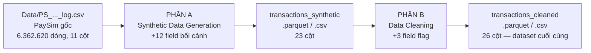
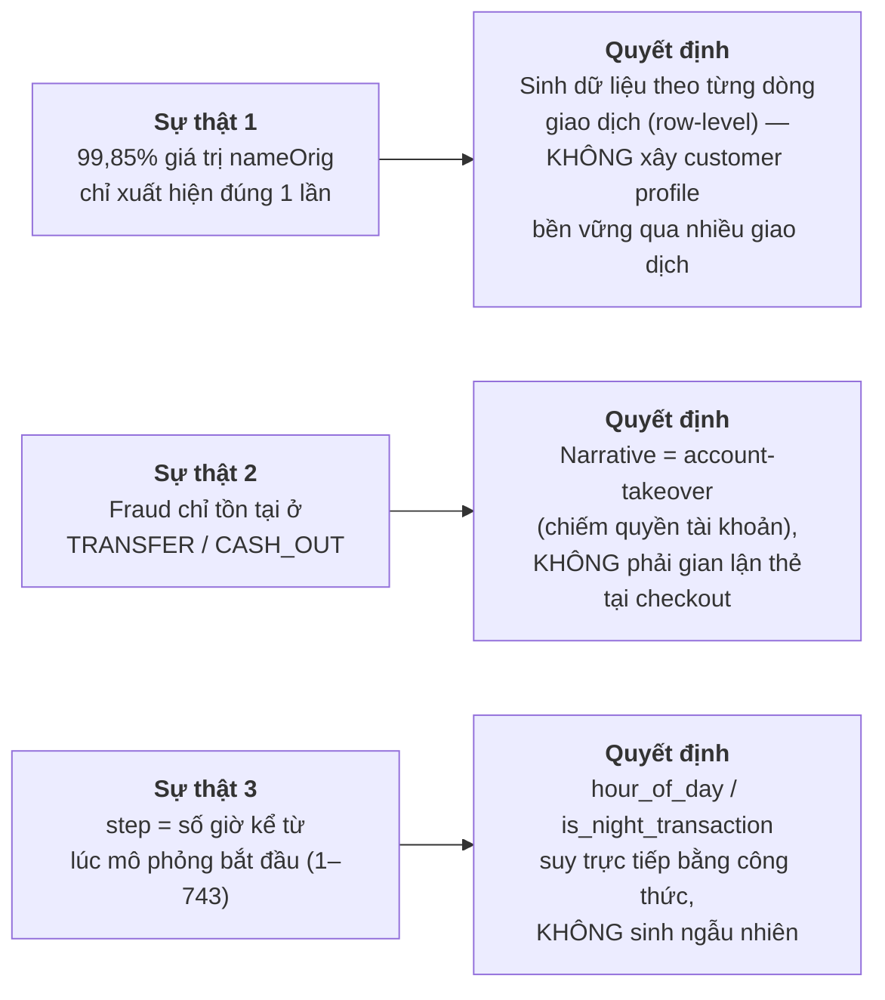
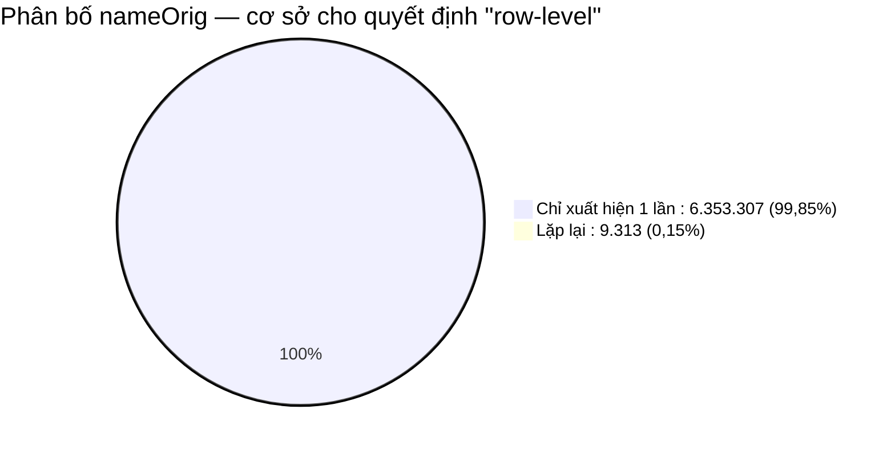
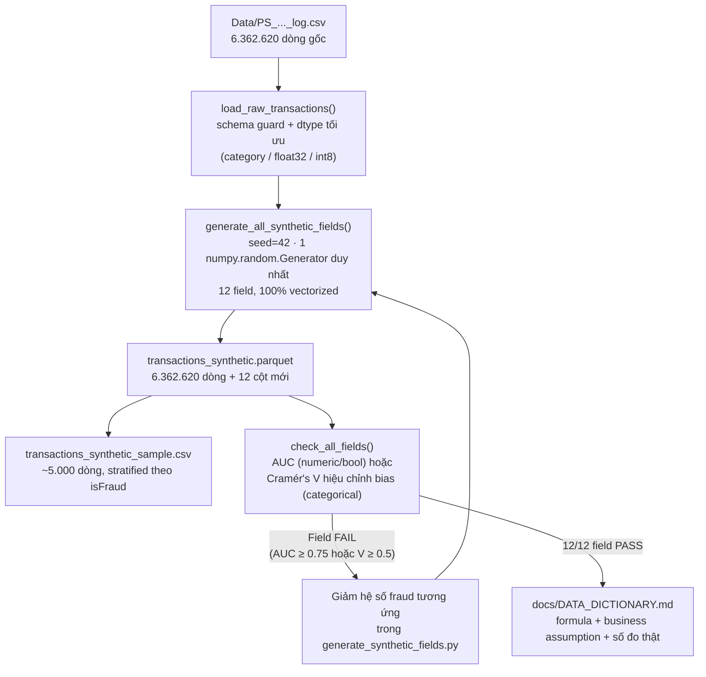
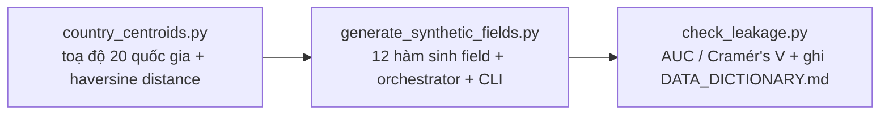
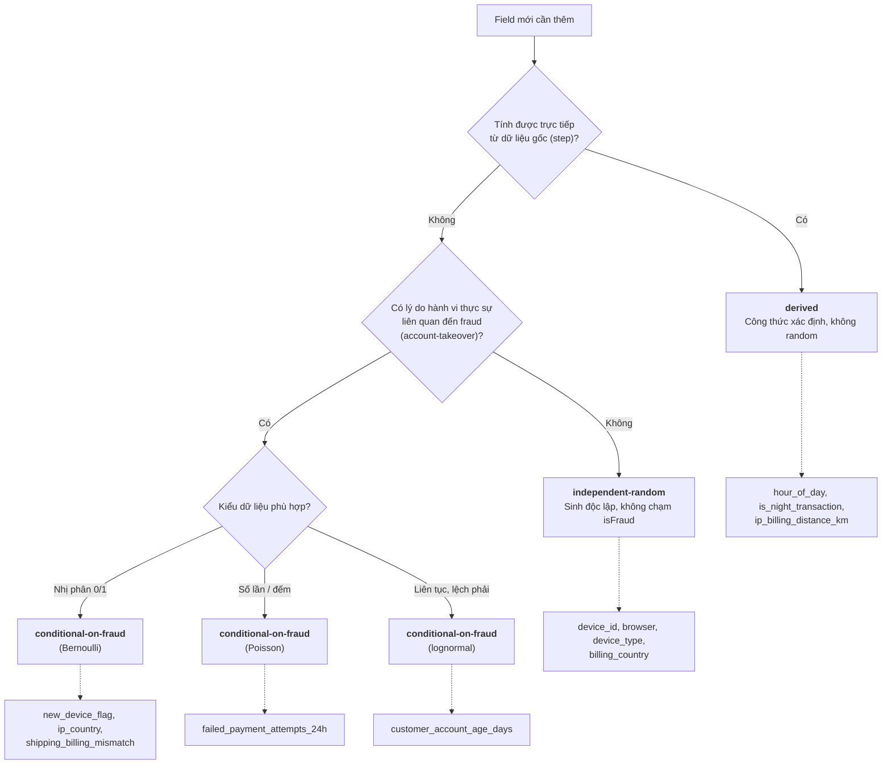
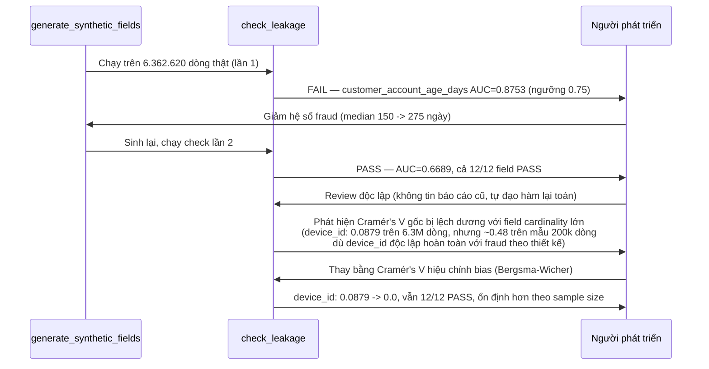
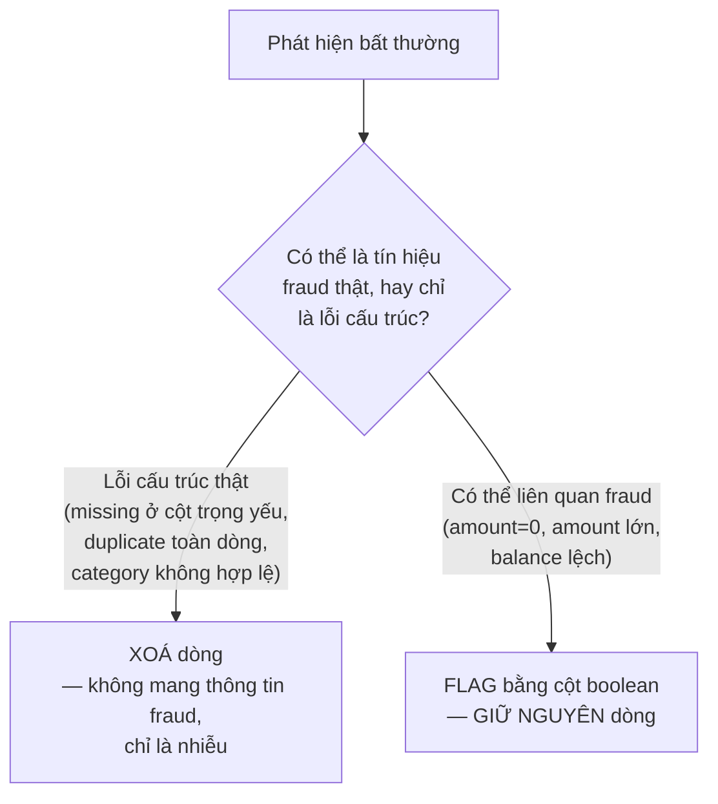
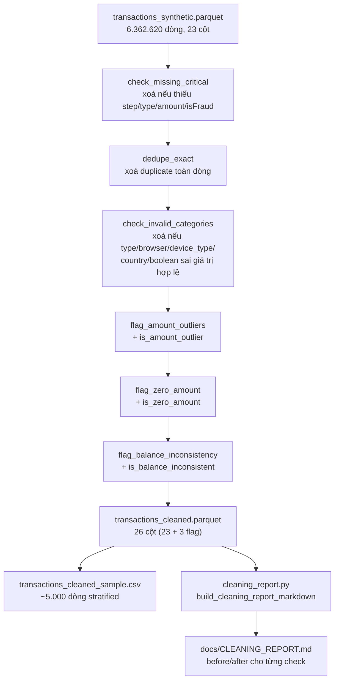

# Data Pipeline: Synthetic Generation & Cleaning — Chiến lược, Logic & Cách chạy

Pipeline 2 giai đoạn cho dataset PaySim, phục vụ bài toán phát hiện gian lận thanh toán (fraud detection) theo thời gian thực: **(A) sinh thêm 12 trường bối cảnh e-commerce/hành vi**, rồi **(B) kiểm tra và làm sạch dữ liệu** (missing values, duplicates, invalid categories, outliers) trước khi bàn giao cho bước feature engineering/modeling.

Tài liệu này là **nguồn tham khảo đầy đủ, tự chứa** — đọc xong hiểu toàn bộ logic/chiến lược/quy tắc của cả 2 giai đoạn, không cần mở file khác. Tài liệu gốc chi tiết hơn nếu cần tra cứu sâu:
- Spec sinh dữ liệu: [`docs/superpowers/specs/2026-07-03-synthetic-data-nguoi2-design.md`](docs/superpowers/specs/2026-07-03-synthetic-data-nguoi2-design.md) · Plan: [`...-nguoi2-plan.md`](docs/superpowers/plans/2026-07-03-synthetic-data-nguoi2-plan.md)
- Spec cleaning: [`docs/superpowers/specs/2026-07-03-data-cleaning-design.md`](docs/superpowers/specs/2026-07-03-data-cleaning-design.md) · Plan: [`...-data-cleaning-plan.md`](docs/superpowers/plans/2026-07-03-data-cleaning-plan.md)
- Data dictionary (tự sinh): [`docs/DATA_DICTIONARY.md`](docs/DATA_DICTIONARY.md) · Cleaning report (tự sinh): [`docs/CLEANING_REPORT.md`](docs/CLEANING_REPORT.md)

## 1. Tổng quan toàn bộ pipeline



**Nguồn dữ liệu:** `Data/PS_20174392719_1491204439457_log.csv` — PaySim / Online Payments Fraud Dataset, **6.362.620 dòng, dùng toàn bộ** (không lấy mẫu). Cột gốc: `step, type, amount, nameOrig, oldbalanceOrg, newbalanceOrig, nameDest, oldbalanceDest, newbalanceDest, isFraud, isFlaggedFraud`.

---

# PHẦN A — SYNTHETIC DATA GENERATION

## 2. Bài toán

Kaggle PaySim chỉ có dữ liệu giao dịch tài chính thô (số tiền, số dư, loại giao dịch...), không có các trường "bối cảnh e-commerce" cần thiết để mô hình fraud detection có đủ tín hiệu hành vi (device fingerprint, khoảng cách IP-billing, tuổi tài khoản, mismatch địa chỉ, số lần thanh toán thất bại, pattern theo giờ). Phần A sinh thêm 12 trường đó bằng Python (Faker + business logic tự viết), đồng thời **tự kiểm tra khách quan** để đảm bảo dữ liệu sinh ra thực tế nhưng không "lộ" nhãn fraud một cách giả tạo (data leakage).

## 3. Sự thật dữ liệu → Quyết định thiết kế

Trước khi viết bất kỳ dòng code nào, 3 sự thật sau được **đo trực tiếp trên file gốc** và quyết định toàn bộ hướng thiết kế:



Chi tiết sự thật 1 (đo trên toàn bộ 6.362.620 dòng):



Chi tiết sự thật 2 — số fraud theo loại giao dịch (khớp đúng tỷ lệ 0,1291% đã có trong audit trước đó):

| Loại giao dịch | Số dòng | Số fraud |
|---|---|---|
| `TRANSFER` | 532.909 | 4.097 |
| `CASH_OUT` | 2.237.500 | 4.116 |
| `PAYMENT` | 2.151.495 | 0 |
| `CASH_IN` | 1.399.284 | 0 |
| `DEBIT` | 41.432 | 0 |

**Vì sao quan trọng:** nếu bỏ qua bước đo này và thiết kế theo trực giác thông thường (customer profile bền vững, narrative "checkout fraud"), thiết kế sẽ sai lệch với chính dữ liệu đang dùng.

## 4. Nguyên tắc thiết kế cốt lõi

| # | Nguyên tắc | Lý do |
|---|---|---|
| 1 | Sinh **row-level**, không customer profile | Sự thật 1 — không có lịch sử khách hàng đáng kể để dùng lại |
| 2 | Chỉ tiêm tín hiệu fraud vào field **có lý do hành vi thật** (new device, IP lệch, giờ đêm, tài khoản mới, mismatch địa chỉ, thất bại thanh toán). Field không có cơ sở hành vi (`browser`, `device_type`, `device_id`, `billing_country`) sinh **độc lập** với `isFraud` | Dữ liệu gian lận thật không bao giờ có *mọi* field tương quan với nhãn — nếu ép hết thì chính là dấu hiệu leakage giả tạo |
| 3 | Mọi hệ số (odds-ratio, Poisson λ, median gap) **giới hạn 2–4 lần baseline** | Mỗi con số phải giải trình được (justify the realism), không phải chọn để đạt AUC cao. Fraud giỏi vẫn giả mạo được hành vi bình thường, nên tín hiệu không bao giờ tuyệt đối |
| 4 | Field tính được trực tiếp từ dữ liệu gốc (`step`) thì **suy bằng công thức**, không random | Không có lý do "đoán" khi dữ liệu gốc đã cho biết chính xác |
| 5 | Đo leakage **khách quan bằng số** sau khi sinh, không chỉ "cảm thấy hợp lý" | AUC/Cramér's V là con số lặp lại được, là bằng chứng khách quan cho tính rigor của quy trình |

## 5. Kiến trúc pipeline sinh dữ liệu



**Module phụ trách từng phần:**



**Nguyên tắc kỹ thuật:** mọi hàm sinh dữ liệu dùng **numpy/pandas vectorized** (không loop qua từng dòng trong 6,3 triệu dòng), dùng chung **một** `numpy.random.Generator(seed=42)` cho cả lượt chạy → kết quả **tái lập được 100%** khi chạy lại với cùng input.

## 6. Quy tắc phân loại field (logic quyết định mỗi field sinh thế nào)



## 7. Chi tiết 12 field synthetic

| # | Field | Loại sinh | Base → Fraud | Lập luận chọn số |
|---|---|---|---|---|
| 1 | `hour_of_day` | derived | `(step - 1) % 24` | Suy trực tiếp từ `step`, không cần giả định |
| 2 | `is_night_transaction` | derived | `hour_of_day ∈ [0,5]` | Định nghĩa "đêm" = 0h–6h, quy ước phổ biến trong nghiên cứu fraud theo giờ |
| 3 | `customer_account_age_days` | conditional (lognormal) | median 400 → 275 ngày¹ | Tài khoản bị chiếm đoạt/mule thường tạo gần đây hơn — hệ số thận trọng, là business assumption, không suy từ số liệu thực |
| 4 | `device_id` | độc lập | pool cố định 50.000 UUID (Faker) | Không tự thân là tín hiệu fraud; tín hiệu nằm ở `new_device_flag` (#7), tránh trùng lặp thông tin |
| 5 | `browser` | độc lập | Chrome 55% / Safari 20% / Edge 12% / Firefox 8% / Other 5% | Không có cơ sở hành vi để gắn với fraud — cố ý trung lập, tránh over-signal giả tạo |
| 6 | `device_type` | độc lập | mobile 65% / desktop 30% / tablet 5% | Tương tự #5 |
| 7 | `new_device_flag` | conditional (Bernoulli) | p = 0.04 → 0.12 (3x) | ~4% giao dịch hợp pháp từ thiết bị mới là hợp lý; fraud tăng gấp 3 vì account-takeover thường từ thiết bị lạ, nhưng không tuyệt đối |
| 8 | `billing_country` | độc lập | categorical, 20 quốc gia | Mô phỏng cơ cấu khách hàng nền tảng; tín hiệu nằm ở mismatch (#9), không phải ở đây |
| 9 | `ip_country` | conditional | match rate 0.93 → 0.80 | Giao dịch hợp pháp đa số dùng IP đúng quốc gia; fraud lệch cao hơn nhưng vẫn phần lớn trùng (VPN/proxy giúp fraud giả mạo IP) |
| 10 | `ip_billing_distance_km` | **derived** từ #8, #9 | `haversine(centroid[ip_country], centroid[billing_country])` | Tính trực tiếp bằng bảng tọa độ cố định — đảm bảo nhất quán nội tại, không mâu thuẫn với mismatch flag |
| 11 | `shipping_billing_mismatch` | conditional (Bernoulli) | p = 0.05 → 0.15 (3x) | Một số khách hợp pháp có địa chỉ giao khác đăng ký (quà tặng, công ty); fraud tăng vì có thể đổi hướng nhận tiền/hàng. Diễn giải lại thành "địa chỉ giao dịch khác đăng ký" do fraud PaySim là account-takeover, không phải checkout thẻ |
| 12 | `failed_payment_attempts_24h` | conditional (Poisson) | λ = 0.15 → 0.6 (4x) | Đa số giao dịch hợp pháp không có lần thất bại trước; kẻ gian thường thử nhiều lần trước khi thành công |

¹ Giá trị 275 (thay vì 150 như thiết kế ban đầu) đã được **tinh chỉnh sau khi kiểm tra leakage trên dữ liệu thật** — xem mục 8.

## 8. Cơ chế chống leakage — và 2 lần đã phát hiện + sửa lỗi thật

**Quy trình:** sau khi sinh xong, tính **AUC đơn biến** (field numeric/boolean) hoặc **Cramér's V** (field categorical) so với `isFraud`. Ngưỡng FAIL: `AUC ≥ 0.75` hoặc `Cramér's V ≥ 0.5`. Nếu FAIL → giảm hệ số ở mục 7, sinh lại — **không đổi ngưỡng để "cho qua"**.

Đây không chỉ là lý thuyết — quy trình này đã thực sự bắt được 2 lỗi trong quá trình build:



**Bài học rút ra:** nếu `check_leakage` báo FAIL, đó là quy trình đang hoạt động đúng — không phải bug (xem mục 17 để biết cách xử lý). Cramér's V dùng công thức **hiệu chỉnh bias** (không phải công thức chuẩn sách giáo khoa) vì field cardinality lớn (`device_id`, 50.000 giá trị) bị lệch dương với công thức gốc, đặc biệt nhạy với **kích thước dataset**.

## 9. Kết quả đo được trên dữ liệu thật (Phần A)

Row count và tỷ lệ fraud giữ nguyên (0,1291%) so với file gốc — bước sinh dữ liệu **không làm thay đổi class imbalance**. Xử lý imbalance kỹ thuật (SMOTE, class weight...) không thuộc phạm vi phần này, để lại cho bước feature engineering/modeling phía sau.

| Field | Metric | Giá trị đo được | Kết quả |
|---|---|---|---|
| `hour_of_day` | AUC | 0.6336 | PASS |
| `is_night_transaction` | AUC | 0.6217 | PASS |
| `customer_account_age_days` | AUC | 0.6689 | PASS |
| `device_id` | Cramér's V (hiệu chỉnh bias) | 0.0 | PASS |
| `browser` | Cramér's V (hiệu chỉnh bias) | 0.0 | PASS |
| `device_type` | Cramér's V (hiệu chỉnh bias) | 0.0004 | PASS |
| `new_device_flag` | AUC | 0.5419 | PASS |
| `billing_country` | Cramér's V (hiệu chỉnh bias) | 0.0 | PASS |
| `ip_country` | Cramér's V (hiệu chỉnh bias) | 0.0049 | PASS |
| `ip_billing_distance_km` | AUC | 0.5651 | PASS |
| `shipping_billing_mismatch` | AUC | 0.5495 | PASS |
| `failed_payment_attempts_24h` | AUC | 0.6589 | PASS |

Số liệu đầy đủ kèm data type, unit, formula, business assumption: [`docs/DATA_DICTIONARY.md`](docs/DATA_DICTIONARY.md) (sinh tự động từ code).

---

# PHẦN B — DATA CLEANING

## 10. Mục đích

Kiểm tra `transactions_synthetic.parquet` (output của Phần A) theo 4 nhóm bắt buộc — **missing values, duplicates, invalid categories, outliers** — và tạo báo cáo before/after, theo đúng 1 nguyên tắc xuyên suốt: **không được làm mất tín hiệu fraud thật** trong lúc "làm sạch" dữ liệu.

## 11. Khảo sát dữ liệu thật trước khi thiết kế

Trước khi viết code, dataset `transactions_synthetic.parquet` (6.362.620 dòng, 23 cột) được khảo sát trực tiếp:

| Khảo sát | Kết quả | Ý nghĩa |
|---|---|---|
| Missing values (toàn bộ 23 cột) | 0 | Dataset sạch về mặt này — nhưng vẫn cần code check (defensive), phòng khi chạy trên dữ liệu khác |
| Duplicate toàn dòng | 0 | Tương tự |
| Duplicate theo key giao dịch | 0 | Tương tự |
| `type` ngoài 5 giá trị PaySim hợp lệ | 0 | Tương tự |
| `isFraud`/`isFlaggedFraud` ngoài {0,1}, format `nameOrig`/`nameDest`, khoảng trống `step`, cột boolean, bất biến chéo giữa các field | 0 tất cả | Dataset nhất quán nội tại hoàn toàn |
| Số dư âm | 0 | — |
| **`amount = 0`** | **16 dòng** | **Toàn bộ 16 dòng đều là `isFraud=1`, `type=CASH_OUT`** — đây có thể là dấu vết kẻ gian "thử" hệ thống trước khi rút tiền thật |
| **`amount` outlier (Tukey IQR)** | **338.078 dòng (5,31%)** | Giao dịch giá trị bất thường lớn — trong bài toán fraud, đây chính xác là loại tín hiệu cần giữ, không phải nhiễu |
| **`oldbalanceOrg − amount ≠ newbalanceOrig`** | **5.118.892 dòng (80,45%)** | Đặc điểm đã biết của PaySim (giao dịch đến merchant thường không track số dư đích) — KHÔNG phải lỗi nhập liệu |

**Kết luận:** dataset đã rất sạch về cấu trúc. Việc "cleaning" ở đây thực chất là (a) dựng đầy đủ các bước kiểm tra mang tính phòng vệ (defensive — không có tác dụng trên lần chạy này nhưng đúng nếu chạy trên dữ liệu khác), và (b) **đánh dấu (flag) 3 loại bất thường thật** đã tìm thấy mà không xoá dòng nào.

## 12. Nguyên tắc thiết kế: Flag, không xoá



**Vì sao chọn Flag thay vì xoá:** 16 dòng `amount=0` đều là fraud thật — xoá sẽ mất đúng 16 mẫu fraud hiếm; outlier `amount` lớn có thể là chính tín hiệu fraud mà model cần học; 80% "balance inconsistent" là đặc điểm nguồn dữ liệu, xoá sẽ mất 80% dataset một cách vô lý.

## 13. Kiến trúc pipeline cleaning



**Nguyên tắc:** 3 bước đầu (B, C, D) **xoá dòng** — chỉ xử lý lỗi cấu trúc thật, chạy TRƯỚC. 3 bước sau (E, F, G) chỉ **thêm cột flag**, không xoá gì — chạy SAU, trên dữ liệu đã loại lỗi cấu trúc. `check_invalid_categories` dùng lại chính danh sách giá trị hợp lệ (`BROWSER_WEIGHTS`, `DEVICE_TYPE_WEIGHTS`, `COUNTRY_WEIGHTS`) từ module sinh dữ liệu ở Phần A — không hardcode một bản sao có thể lệch nhau.

## 14. 6 check & Ý nghĩa của 3 cột flag mới

| # | Check | Hành động | Cột kết quả |
|---|---|---|---|
| 1 | Missing values ở cột trọng yếu | Xoá dòng | — |
| 2 | Duplicate toàn dòng | Xoá dòng | — |
| 3 | Invalid categories (`type`, 4 cột categorical synthetic, 3 cột boolean) | Xoá dòng | — |
| 4 | Outlier `amount` (Tukey IQR: Q1−1.5×IQR, Q3+1.5×IQR) | Flag, giữ nguyên | `is_amount_outlier` |
| 5 | `amount = 0` | Flag, giữ nguyên | `is_zero_amount` |
| 6 | `oldbalanceOrg − amount ≠ newbalanceOrig` (sai lệch > 0.01) | Flag, giữ nguyên | `is_balance_inconsistent` |

**Ý nghĩa cụ thể của từng cột flag — vì sao cần giữ lại và dùng thế nào ở bước sau:**

- **`is_amount_outlier`** (338.078 dòng, 5,31%): đánh dấu giao dịch có giá trị vượt ngưỡng thống kê thông thường (Tukey fence). Đây **không phải lỗi** — trong fraud detection, giao dịch giá trị bất thường lớn thường chính là dấu hiệu đáng ngờ. Ý nghĩa sử dụng: (a) có thể dùng trực tiếp làm **feature nhị phân** cho model (giả thuyết: `is_amount_outlier=True` tương quan với fraud), (b) dùng để lọc subset khi cần phân tích "giao dịch điển hình" riêng biệt với "giao dịch giá trị lớn", (c) tránh việc vô tình bỏ outlier như nhiễu — điều rất dễ mắc lỗi nếu áp dụng cleaning tự động không phân biệt ngữ cảnh fraud.

- **`is_zero_amount`** (16 dòng): đánh dấu giao dịch `amount=0`. Đây là trường hợp cực hiếm nhưng **có tín hiệu cực mạnh** — 100% các dòng quan sát được đều là fraud thật (giả thuyết: kẻ gian "test" hệ thống/tài khoản trước khi rút tiền thật). Ý nghĩa sử dụng: dù chỉ 16/6.362.620 dòng, cột này có thể là **1 trong những feature dự đoán tốt nhất** nếu pattern này lặp lại ở dữ liệu tương lai — tuyệt đối không nên loại bỏ hoặc coi là "dữ liệu rác" khi làm feature engineering.

- **`is_balance_inconsistent`** (5.118.892 dòng, 80,45%): đánh dấu giao dịch có `oldbalanceOrg - amount ≠ newbalanceOrig`. Tỷ lệ cao bất thường (80%) khiến dễ hiểu lầm là lỗi dữ liệu nghiêm trọng — **thực chất đây là đặc điểm cố hữu của PaySim** (nhiều giao dịch đến merchant/tài khoản đích không track số dư chính xác). Ý nghĩa sử dụng: (a) **không nên báo cáo con số 80% này như một vấn đề chất lượng dữ liệu** khi trình bày — sẽ gây hiểu lầm nghiêm trọng; (b) cột flag vẫn có giá trị làm feature phụ vì bản thân việc "có track số dư đầy đủ hay không" có thể tương quan với loại giao dịch/kênh xử lý; (c) dùng để lọc subset "balance đầy đủ" nếu một phân tích cụ thể cần dữ liệu balance đáng tin cậy.

**Tóm lại:** cả 3 cột flag đều là **boolean, dùng được ngay làm feature** cho bước Model Development, hoặc dùng để lọc/subset dữ liệu khi cần. Không cột nào nên bị xoá hay bỏ qua.

## 15. Kết quả đo được trên dữ liệu thật (Phần B)

Chạy trên toàn bộ 6.362.620 dòng — row count **không đổi** (0 dòng bị xoá vì không có lỗi cấu trúc thật):

| Check | rows_before | rows_flagged/removed | Hành động |
|---|---|---|---|
| Missing values | 6.362.620 | 0 | removed |
| Duplicates | 6.362.620 | 0 | removed |
| Invalid categories | 6.362.620 | 0 | removed |
| `is_amount_outlier` | 6.362.620 | 338.078 (5,31%) | flagged (kept) |
| `is_zero_amount` | 6.362.620 | 16 | flagged (kept) |
| `is_balance_inconsistent` | 6.362.620 | 5.118.892 (80,45%) | flagged (kept) |

Báo cáo đầy đủ (tự sinh từ code): [`docs/CLEANING_REPORT.md`](docs/CLEANING_REPORT.md).

---

# TỔNG HỢP

## 16. Cấu trúc code & test

```
src/data_generation/
  country_centroids.py          # Bảng tọa độ 20 quốc gia + haversine distance
  generate_synthetic_fields.py  # 12 hàm sinh field + orchestrator + CLI (CSV -> Parquet)
  check_leakage.py              # AUC / Cramér's V (bias-corrected) + sinh docs/DATA_DICTIONARY.md
src/data_cleaning/
  clean_transactions.py         # 6 hàm check/flag + orchestrator clean_dataset() + CLI
  cleaning_report.py            # build_cleaning_report_markdown() + CLI ghi docs/CLEANING_REPORT.md
tests/data_generation/          # 52 unit test
tests/data_cleaning/            # 18 unit test
```

70 test tổng cộng: đúng tỷ lệ base/fraud theo từng công thức, tái lập được (reproducibility), không tràn kiểu dữ liệu, bất biến toán học kiểm tra exhaustive, schema guard khi đọc CSV, và với module cleaning: đúng số dòng xoá/flag theo từng kịch bản, không đụng đến dòng không liên quan.

**Cấu trúc file dữ liệu output** (`data/processed/`, đã `.gitignore` do dung lượng lớn):

| File | Giai đoạn | Số dòng | Số cột |
|---|---|---|---|
| `transactions_synthetic.parquet` / `.csv` | Sau Phần A | 6.362.620 | 23 |
| `transactions_synthetic_sample.csv` | Sau Phần A (mẫu) | ~5.000 | 23 |
| `transactions_cleaned.parquet` / `.csv` | Sau Phần B — **bản cuối cùng** | 6.362.620 | 26 |
| `transactions_cleaned_sample.csv` | Sau Phần B (mẫu) | ~5.000 | 26 |

## 17. Cách chạy end-to-end

Yêu cầu: Python 3.13 (ví dụ `C:\ProgramData\miniconda3\python.exe`), chạy trong git-bash/MSYS.

```bash
# 0. Tạo venv và cài dependency (chỉ cần 1 lần)
"/c/ProgramData/miniconda3/python.exe" -m venv .venv
.venv/Scripts/python.exe -m pip install -r requirements.txt

# 1. Chạy toàn bộ test
.venv/Scripts/python.exe -m pytest tests/ -v

# --- PHẦN A: Synthetic Data Generation ---
# 2. Sinh synthetic data từ dataset gốc (Data/PS_20174392719_1491204439457_log.csv)
PYTHONPATH=src .venv/Scripts/python.exe -m data_generation.generate_synthetic_fields
# -> data/processed/transactions_synthetic.parquet (+ sample CSV)

# 3. Kiểm tra leakage + sinh data dictionary
PYTHONPATH=src .venv/Scripts/python.exe -m data_generation.check_leakage
# -> docs/DATA_DICTIONARY.md

# --- PHẦN B: Data Cleaning ---
# 4. Làm sạch dữ liệu (đọc output của bước 2)
PYTHONPATH=src .venv/Scripts/python.exe -m data_cleaning.clean_transactions
# -> data/processed/transactions_cleaned.parquet (+ sample CSV)

# 5. Sinh cleaning report
PYTHONPATH=src .venv/Scripts/python.exe -m data_cleaning.cleaning_report
# -> docs/CLEANING_REPORT.md
```

**Nếu file CSV của bạn khác cấu trúc** (thiếu cột): bước 2 sẽ báo `ValueError` nêu rõ tên cột thiếu, thay vì lỗi pandas khó hiểu.

**Nếu bước 3 báo FAIL cho field nào:** mở `generate_synthetic_fields.py`, tìm hằng số điều khiển hệ số fraud của field đó (ví dụ `NEW_DEVICE_FLAG_FRAUD_P`), giảm nó về gần baseline hơn (nguyên tắc #3 ở mục 4), chạy lại bước 2 rồi bước 3 đến khi tất cả PASS.

## 18. Giới hạn & rủi ro đã biết

**Phần A (synthetic):**
- Các hệ số odds-ratio/λ là giả định nghiệp vụ tự đặt, không suy từ số liệu fraud thực tế công khai nào.
- `shipping_billing_mismatch` được diễn giải lại thành "địa chỉ giao dịch khác địa chỉ đăng ký" do fraud trong PaySim là account-takeover, không phải checkout thẻ.
- 9.313 `nameOrig` có lặp lại (0,15%) được xử lý như dòng độc lập.
- Cột `amount`/số dư gốc lưu ở `float32` — có thể mất độ chính xác nhỏ ở giá trị lớn; không ảnh hưởng 12 field synthetic.

**Phần B (cleaning):**
- Ngưỡng outlier IQR (1.5×IQR, chuẩn Tukey) là 1 lựa chọn thống kê phổ biến, không phải "đúng duy nhất" — bước modeling sau có thể cần ngưỡng khác.
- Outlier/inconsistency chỉ được **flag**, không loại khỏi dataset — quyết định có dùng làm feature hay không thuộc về bước sau.
- Check invalid category cho cột synthetic dựa trên danh sách giá trị đã dùng để sinh ở Phần A — nếu sinh lại dữ liệu với danh sách khác, cần đồng bộ lại.

## 19. Dùng output cho bước tiếp theo

- Dùng `transactions_cleaned.parquet`/`.csv` (26 cột) làm input cho feature engineering — đây là bản đầy đủ nhất, đã qua cả 2 giai đoạn.
- Các field string (`device_id`, `billing_country`, `ip_country`, `browser`, `device_type`) cần encode; `ip_billing_distance_km`, `failed_payment_attempts_24h` đã là numeric, dùng trực tiếp được.
- 3 cột flag mới (`is_amount_outlier`, `is_zero_amount`, `is_balance_inconsistent`) là boolean, **dùng được ngay làm feature** — xem ý nghĩa chi tiết ở mục 14 trước khi quyết định giữ/bỏ trong model.
- Nếu dataset có sẵn feature dạng balance-delta (số dư trước/sau giao dịch), cần lưu ý: PaySim fraud thường rút sạch số dư nên các feature đó có thể cho AUC-PR rất cao một cách đáng ngờ (leakage sẵn có trong dữ liệu gốc, không liên quan đến các field synthetic/cleaning ở đây). Nên train mô hình có/không các feature đó để so sánh.
