# Tài liệu tổng kết công việc — Data Pipeline (Synthetic Generation & Cleaning)

Tài liệu này ghi lại **đầy đủ, chi tiết** những gì đã thực hiện trong dự án: mục tiêu, quy trình làm việc, quyết định thiết kế, các vấn đề phát hiện và cách xử lý, kết quả kiểm thử, và toàn bộ deliverable. Dùng để làm căn cứ viết báo cáo hoặc bàn giao.

Khác với [`README.md`](../README.md) (giải thích *chiến lược và cách chạy*), tài liệu này ghi lại **quá trình đã làm** — cái gì đã xong, xong như thế nào, phát hiện gì trong lúc làm.

---

## 1. Mục tiêu & phạm vi

Xây dựng pipeline dữ liệu cho bài toán phát hiện gian lận thanh toán (fraud detection), gồm 2 giai đoạn:

1. **Synthetic Data Generation** — sinh thêm 12 trường bối cảnh e-commerce/hành vi (device, IP, thời gian, tài khoản, thanh toán thất bại) cho dataset PaySim gốc, vì dataset gốc chỉ có dữ liệu giao dịch tài chính thô.
2. **Data Cleaning** — kiểm tra và xử lý missing values, duplicates, invalid categories, outliers trên dataset đã sinh, có báo cáo before/after.

**Nguồn dữ liệu:** `Data/PS_20174392719_1491204439457_log.csv` — PaySim/Online Payments Fraud Dataset, 6.362.620 dòng, dùng toàn bộ (không lấy mẫu) xuyên suốt cả 2 giai đoạn.

## 2. Quy trình làm việc

Cả 2 giai đoạn đều đi qua đầy đủ quy trình sau (không code trực tiếp mà không có thiết kế trước):

```mermaid
flowchart LR
    A["Khảo sát dữ liệu thật<br/>(không giả định)"] --> B["Brainstorm<br/>+ đặt câu hỏi làm rõ"]
    B --> C["Viết Design Spec<br/>(docs/superpowers/specs/)"]
    C --> D["Viết Implementation Plan<br/>(docs/superpowers/plans/, TDD)"]
    D --> E["Code từng task theo TDD<br/>(RED -> GREEN -> commit)"]
    E --> F["Review từng task<br/>(spec compliance + code quality)"]
    F --> G["Chạy thật trên<br/>toàn bộ 6.362.620 dòng"]
    G --> H["Review tổng thể toàn nhánh<br/>(whole-branch review)"]
```



**Đặc điểm quan trọng của quy trình:**
- Mọi quyết định thiết kế đều dựa trên **số liệu đo thật** trên dataset, không suy đoán (ví dụ: kiểm tra `nameOrig` có lặp lại không trước khi quyết định sinh dữ liệu theo customer profile hay row-level).
- Mỗi task code đều theo TDD: viết test trước (RED), implement, xác nhận pass (GREEN), rồi mới commit.
- Mỗi task đều được **review độc lập** (không phải người viết code tự chấm), kiểm tra cả spec compliance lẫn code quality.
- Có **review tổng thể toàn bộ nhánh** ở cuối mỗi giai đoạn, dùng model mạnh nhất, tự tính toán lại độc lập (không tin báo cáo cũ) để xác nhận đúng đắn.

---

## 3. GIAI ĐOẠN 1: Synthetic Data Generation

### 3.1. Khảo sát dữ liệu trước khi thiết kế

| Khảo sát | Kết quả | Ảnh hưởng thiết kế |
|---|---|---|
| `nameOrig` duy nhất | 6.353.307 / 6.362.620 (99,85%) | Không có lịch sử khách hàng lặp lại → sinh dữ liệu **row-level**, không xây customer profile |
| Fraud theo loại giao dịch | Chỉ ở `TRANSFER` (4.097) và `CASH_OUT` (4.116); `PAYMENT`/`CASH_IN`/`DEBIT` = 0 | Bản chất fraud là **account-takeover**, không phải gian lận thẻ tại checkout |
| `step` | 1–743, không có khoảng trống | `hour_of_day` suy trực tiếp bằng công thức, không cần random |
| Tỷ lệ fraud tổng | 8.213/6.362.620 = 0,1291% | Khớp với audit đã có trước đó — xác nhận đúng file dữ liệu |

### 3.2. 13 field đã sinh

`hour_of_day`, `is_night_transaction`, `customer_account_age_days`, `device_id`, `browser`, `device_type`, `new_device_flag`, `billing_country`, `ip_country`, `ip_billing_distance_km`, `ip_billing_country_mismatch`, `shipping_billing_mismatch`, `failed_payment_attempts_24h`.

Nguyên tắc: chỉ field có lý do hành vi thật mới điều kiện theo **risk proxy label-free** (`compute_risk_proxy`, tính từ `type`/`amount`/`hour_of_day` — không đọc `isFraud`), giới hạn hệ số 2–4 lần baseline; field không có cơ sở hành vi sinh độc lập. Chi tiết công thức từng field: xem README mục 7 hoặc [`docs/DATA_DICTIONARY.md`](DATA_DICTIONARY.md). **Lịch sử thiết kế:** thiết kế ban đầu điều kiện trực tiếp theo `isFraud` (`if is_fraud: p=0.12 else 0.04`); được viết lại sang label-free sau khi review phát hiện đây là dấu hiệu leakage kinh điển và làm feature không tái tạo được cho giao dịch mới tại thời điểm scoring — xem mục 5, vấn đề #5.

### 3.3. Code

- `src/data_generation/country_centroids.py` — bảng toạ độ 20 quốc gia + haversine distance
- `src/data_generation/generate_synthetic_fields.py` — 12 hàm sinh field + orchestrator + CLI
- `src/data_generation/check_leakage.py` — đo leakage (AUC/Cramér's V) + sinh data dictionary
- **52 unit test**, 100% vectorized, dùng 1 `numpy.random.Generator(seed=42)` duy nhất cho cả lượt chạy

### 3.4. Kết quả trên dữ liệu thật (6.362.620 dòng)

Row count và tỷ lệ fraud giữ nguyên (0,1291%). Leakage check: **13/13 field PASS** (ngưỡng AUC < 0.75, Cramér's V < 0.5). Chi tiết số đo: xem README mục 9.

---

## 4. GIAI ĐOẠN 2: Data Cleaning

### 4.1. Khảo sát dữ liệu trước khi thiết kế

Chạy trên `transactions_synthetic.parquet` (output Giai đoạn 1):

| Khảo sát | Kết quả |
|---|---|
| Missing values, duplicate toàn dòng, invalid category, số dư âm, format `nameOrig`/`nameDest`, khoảng trống `step`, bất biến chéo giữa các field | **0 tất cả** — dataset sạch về cấu trúc |
| `amount = 0` | 16 dòng — **toàn bộ đều là fraud thật** |
| `amount` outlier (Tukey IQR) | 338.078 dòng (5,31%) |
| `oldbalanceOrg − amount ≠ newbalanceOrig` | 5.118.892 dòng (80,45%) — đặc điểm đã biết của PaySim, không phải lỗi |

### 4.2. Nguyên tắc thiết kế: Flag, không xoá

Vì 16 dòng `amount=0` đều là fraud thật và 80% "balance inconsistent" là đặc điểm nguồn dữ liệu, quyết định: **chỉ xoá dòng khi là lỗi cấu trúc thật** (missing ở cột trọng yếu, duplicate toàn dòng, category không hợp lệ — cả 3 loại này đều = 0 dòng trên dữ liệu thật); mọi bất thường có thể liên quan fraud thì **flag bằng cột boolean, giữ nguyên dòng**.

### 4.3. Code

- `src/data_cleaning/clean_transactions.py` — 6 hàm check/flag (`check_missing_critical`, `dedupe_exact`, `check_invalid_categories`, `flag_amount_outliers`, `flag_zero_amount`, `flag_balance_inconsistency`) + orchestrator `clean_dataset()` + CLI
- `src/data_cleaning/cleaning_report.py` — sinh `docs/CLEANING_REPORT.md` tự động
- **18 unit test**

### 4.4. Kết quả trên dữ liệu thật

| Check | Hành động | Kết quả |
|---|---|---|
| Missing values | Xoá nếu có | 0 dòng xoá |
| Duplicates | Xoá nếu có | 0 dòng xoá |
| Invalid categories | Xoá nếu có | 0 dòng xoá |
| `is_amount_outlier` | Flag | 338.078 dòng (5,31%) |
| `is_zero_amount` | Flag | 16 dòng |
| `is_balance_inconsistent` | Flag | 5.118.892 dòng (80,45%) |

Row count không đổi: 6.362.620 dòng, 26 cột (23 cột từ Giai đoạn 1 + 3 cột flag mới). Ý nghĩa chi tiết từng cột flag: xem README mục 14 và mục 16 (full field reference).

---

## 5. Các vấn đề đã phát hiện và xử lý trong quá trình làm

Đây là bằng chứng cụ thể cho thấy quy trình kiểm tra hoạt động thật, không chỉ là thủ tục hình thức:

| # | Vấn đề phát hiện | Cách phát hiện | Cách xử lý | Kết quả sau xử lý |
|---|---|---|---|---|
| 1 | `customer_account_age_days` vượt ngưỡng leakage thật (AUC 0,8753 > 0,75) khi chạy trên 6,36M dòng thật | Chạy leakage check lần đầu trên dữ liệu thật | Giảm hệ số fraud (median 150 → 275 ngày), sinh lại | AUC 0,6689 — PASS |
| 2 | Công thức Cramér's V gốc bị lệch dương (bias) với field cardinality lớn — `device_id` có thể báo FAIL giả (~0,48) nếu chạy trên mẫu nhỏ hơn, dù không có tương quan thật | Review độc lập, tự đạo hàm lại toán thay vì tin kết quả cũ | Thay bằng Cramér's V hiệu chỉnh bias (Bergsma, 2013) | `device_id`: 0,0879 → 0,0; vẫn 12/12 PASS, ổn định hơn theo cỡ mẫu |
| 3 | Data dictionary không phân biệt rõ giá trị nào là AUC, giá trị nào là Cramér's V | Review tổng thể toàn nhánh | Thêm nhãn `(AUC)` / `(Cramér's V)` vào từng giá trị | Đọc rõ ràng, không nhầm thang đo |
| 4 | Subagent xác minh dữ liệu thật (Task 8, giai đoạn Cleaning) bị ngắt giữa chừng do hết giới hạn phiên làm việc | Theo dõi trạng thái subagent | Tự kiểm tra lại độc lập từ file parquet thật (không tin báo cáo dở dang), hoàn tất commit còn thiếu | Số liệu khớp chính xác 100% với khảo sát ban đầu |
| 5 | Code sinh 5 field (`customer_account_age_days`, `new_device_flag`, `ip_country`, `shipping_billing_mismatch`, `failed_payment_attempts_24h`) đọc trực tiếp `isFraud` để chọn tham số (`if is_fraud: p=0.12 else 0.04`) — là dấu hiệu leakage kinh điển với người review fraud detection, và feature không tái tạo được cho giao dịch mới tại thời điểm scoring (chưa biết `isFraud`) | Review kỹ thuật độc lập, đối chiếu với yêu cầu Module 6 (API phải score giao dịch mới real-time) | Viết `compute_risk_proxy()` label-free (chỉ dùng `type`/`amount`/`hour_of_day`, cố ý tránh `oldbalanceOrg`/`newbalanceOrig` vì 2 cột này gần-xác-định `isFraud` trong PaySim); 5 hàm sinh field đổi sang nhận `risk_score` thay `is_fraud`; thêm test static + hành vi xác nhận không đọc nhãn; regenerate toàn bộ artifact từ file CSV gốc | 13/13 field vẫn PASS leakage check; AUC 5 field đổi giảm từ 0,55–0,67 xuống 0,51–0,55 (đúng kỳ vọng — tín hiệu yếu hơn vì không còn đọc nhãn trực tiếp); 82/82 test pass |

## 6. Kết quả kiểm thử tổng hợp

- **82/82 unit test pass** (64 cho Synthetic Generation + 18 cho Data Cleaning)
- 2 lượt **review tổng thể toàn nhánh** (1 cho mỗi giai đoạn), verdict cả 2 lần: **"Ready to merge: Yes"**, 0 lỗi Critical/Important
- Đã chạy thật và verify độc lập nhiều lần trên toàn bộ 6.362.620 dòng cho cả 2 giai đoạn

## 7. Danh sách đầy đủ deliverable

**Code:**
```
src/data_generation/country_centroids.py
src/data_generation/generate_synthetic_fields.py
src/data_generation/check_leakage.py
src/data_cleaning/clean_transactions.py
src/data_cleaning/cleaning_report.py
tests/data_generation/ (52 test)
tests/data_cleaning/ (18 test)
```

**Dữ liệu output** (`data/processed/`, không commit git do dung lượng):
```
transactions_synthetic.parquet / .csv     — sau Giai đoạn 1 (24 cột)
transactions_synthetic_sample.csv         — mẫu ~5.000 dòng
transactions_cleaned.parquet / .csv       — sau Giai đoạn 2, BẢN CUỐI CÙNG (27 cột)
transactions_cleaned_sample.csv           — mẫu ~5.000 dòng
```

**Tài liệu:**
```
README.md                                          — chiến lược, logic, cách chạy, full field reference
docs/DATA_DICTIONARY.md                            — data dictionary 12 field synthetic (tự sinh)
docs/CLEANING_REPORT.md                            — báo cáo before/after cleaning (tự sinh)
docs/PROJECT_SUMMARY.md                             — tài liệu này
docs/superpowers/specs/2026-07-03-synthetic-data-nguoi2-design.md  — spec thiết kế Giai đoạn 1
docs/superpowers/specs/2026-07-03-data-cleaning-design.md          — spec thiết kế Giai đoạn 2
docs/superpowers/plans/2026-07-03-synthetic-data-nguoi2-plan.md    — kế hoạch triển khai Giai đoạn 1
docs/superpowers/plans/2026-07-03-data-cleaning-plan.md            — kế hoạch triển khai Giai đoạn 2
```

## 8. Giới hạn đã biết (không chặn, đã ghi nhận)

- **Chuyển sang label-free giải quyết leakage-smell và vấn đề tái tạo lúc scoring, nhưng KHÔNG làm dữ liệu thực tế hơn** — 5 field conditional vẫn được tiêm tương quan theo thiết kế (qua risk proxy tự chọn), và về thống kê gần như redundant với `type`/`amount`/`hour_of_day` đã có sẵn. Chi tiết: README mục 19.
- PaySim gốc có leakage sẵn có qua `oldbalanceOrg`/`newbalanceOrig` (không liên quan phần synthetic/cleaning này) — cần Module 5 xử lý riêng, xem README mục 19.
- Các hệ số odds-ratio/λ trong sinh dữ liệu synthetic là giả định nghiệp vụ tự đặt, không suy từ số liệu fraud thực tế công khai.
- Ngưỡng outlier IQR (1.5×IQR) là 1 lựa chọn thống kê phổ biến, không phải "đúng duy nhất".
- Cột flag cleaning chỉ đánh dấu, không loại khỏi dataset — quyết định dùng làm feature hay không thuộc về bước sau.
- Một vài ghi chú Minor từ review (vị trí import, 2 CLI tính `clean_dataset` 2 lần, thiếu cột `rows_after` so với spec gốc...) — reviewer xác nhận không cần sửa trước khi dùng.

## 9. Việc chưa làm / ngoài phạm vi

- **EDA, feature engineering, huấn luyện model, deploy, monitoring** — các giai đoạn tiếp theo của pipeline fraud detection, chưa thực hiện trong phạm vi 2 giai đoạn này.
- **File rác trong git chưa xử lý:** `Data.txt` (đã xoá nhưng chưa commit), `phancong.txt`, `yeucau.txt` (chưa track) — cần quyết định commit/gitignore/giữ nguyên.
- **Lịch sử git cũ:** một số commit trước đó có gắn trailer đồng tác giả AI, đã tạm dừng xử lý theo yêu cầu — vẫn còn treo nếu cần dọn dẹp sau này.
